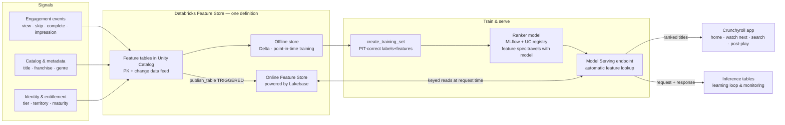

# Crunchyroll · Feature Store on Lakebase — end-to-end walkthrough

30 minutes · customer-facing · Databricks Feature Engineering in Unity Catalog + Lakebase Online Feature Store + Model Serving

**From viewer signals to the next best anime.** This repo is a complete,
runnable content-recommendation pipeline for a Crunchyroll scenario on a live
Databricks workspace: synthetic engagement events land in Unity Catalog, one
set of feature definitions produces point-in-time training data offline and
latest keyed values in a Lakebase-backed online store, and a registered
ranking model serves personalized "watch next" lists through automatic
feature lookup — with every decision captured for the learning loop.

Everything below already ran on a live workspace. The screenshots are real,
the endpoint is live, and the notebooks can be re-run top to bottom.

## Contents

1. [The story in one breath](#the-story-in-one-breath)
2. [Architecture](#architecture)
3. [What got built](#what-got-built)
4. [Run order](#run-order)
5. Walkthrough
   - [Step 0 · Data curation](#step-0--data-curation--synthetic-crunchyroll-signals-land-in-unity-catalog)
   - [Step 1 · Feature engineering](#step-1--feature-engineering--define-features-once--two-stores-two-jobs)
   - [Step 2 · Training](#step-2--training--point-in-time-correct-no-leakage-by-construction)
   - [Step 3 · Deployment](#step-3--deployment--the-endpoint-fetches-its-own-features)
   - [Step 4 · Inference](#step-4--inference--one-governed-api--keys-and-context-in-ranked-titles-out)
   - [Step 5 · Freshness loop](#step-5--freshness-loop--a-binge-should-change-the-next-ranking)
   - [Step 6 · Learning loop](#step-6--the-learning-loop)
6. [Operating notes for production](#operating-notes-for-the-production-conversation)
7. [Live-demo fallbacks](#fast-fallbacks-live-demo-insurance)
8. [Going deeper](#going-deeper--the-documentation-as-a-map)

---

## The story in one breath

Every Crunchyroll surface asks the same question: given this viewer, this
session and this catalog, what should we show next? Genre affinity builds
over months; a skip matters within seconds. One pipeline pattern cannot serve
both — so teams rebuild feature joins by hand and every divergence becomes
training-serving skew.

This demo shows the fix: **define a feature once, use it everywhere.** The
same governed definitions feed historically correct training data (offline,
Delta Lake in Unity Catalog) and low-latency keyed reads (online, Lakebase),
and the serving endpoint retrieves the features itself because the feature
spec travels inside the registered model.

## Architecture



The Crunchyroll feature map — freshness is chosen **per feature class**, never globally:

| Feature class | Demo table | Examples | Offline use | Online use |
|---|---|---|---|---|
| Long-horizon viewer | `viewer_features_ts` → `viewer_features_current` | genre affinity (8 genres), completion propensity, watch frequency | PIT training | Latest keyed values for ranking |
| Recent behavior | `recent_behavior_current` | minutes watched 24h, skips 24h, last genre | Periodic recompute | Refreshed on trigger (streaming in production) |
| Title & catalog | `title_features` | popularity 30d, rating, recency, simulcast, genre flags | Training + retrieval | Candidate context |
| Request-time context | sent in the request | surface, device, locale, hour | Reconstructed for eval | Supplied by the app |
| Policy & entitlement | `entitlements` | territory, tier, maturity | — | Hard filter before scoring |

## What got built

| Layer | Object | Location |
|---|---|---|
| Raw signals | `titles` (132), `viewers` (300), `entitlements`, `engagement_events` | Unity Catalog schema `crunchyroll_demo` |
| Feature tables | `viewer_features_ts`, `viewer_features_current`, `title_features`, `recent_behavior_current` | same schema |
| Online store | `crunchyroll-online-store` (Lakebase Autoscaling, CU_2) | Lakebase project |
| Online tables | `online_viewer_features`, `online_title_features`, `online_recent_behavior` | same schema |
| Model | `crunchyroll_ranker` v1 — holdout AUC 0.6643 | UC model registry |
| Endpoint | `crunchyroll-watch-next-ranker` + inference table `cr_ranker_inference_payload` | Model Serving |

## Run order

Prerequisites: a serverless Databricks workspace with Lakebase (Online
Feature Store) enabled, and the Databricks CLI configured against it. Every
notebook runs as a one-click job on serverless compute — no cluster config.
~35 min for a full rebuild; ~30 min to present.

Each is a notebook in `notebooks/`, importable as-is. Every notebook takes a
`catalog` widget (top of the notebook) — point it at any catalog where you
have create rights; the default is the demo author's:

| # | Lifecycle stage | Notebook | What it does | Runtime |
|---|---|---|---|---|
| 0 | Data curation | `00_data_generation.py` | Synthetic catalog, viewers, entitlements, 90 days of engagement | ~2 min |
| 1 | Feature engineering | `01_feature_engineering.py` | Feature tables → online store → publish | ~8 min |
| 2 | Training | `02_train_ranker.py` | PIT proof, train ranker, `log_model` with feature spec | ~4 min |
| 3 | Deployment | `03_deploy_endpoint.py` | Serving endpoint with inference tables | ~8 min |
| 4 | Inference | `04_query_ranker.py` | Keys + context in → ranked titles out; latency | ~2 min |
| 5 | Freshness | `05_freshness_demo.py` | In-session burst → re-publish → ranking moves | ~4 min |

---

## Step 0 · Data curation — synthetic Crunchyroll signals land in Unity Catalog

132 recognizable anime titles (Attack on Titan to Gachiakuta), 300 viewers
with latent genre affinities, an entitlement matrix (tier × territory ×
maturity hard filter), and 90 days of impressions, plays, skips and
completes. Events are generated with real signal — affinity match,
popularity, recency and position all move the play probability — so the
model has something honest to learn.


Say:
> "Nothing here is feature-store specific yet. These are the governed raw
> signals any media company already has — viewing events, catalog metadata,
> entitlements. The feature store starts from here."

## Step 1 · Feature engineering — define features once, two stores, two jobs

`01_feature_engineering.py` builds four feature tables. The viewer table
exists in two forms: daily **snapshots** for point-in-time training, and a
**current** mirror for serving. Both come from the same definitions.

- Primary keys + non-null + Change Data Feed — the contract an online store needs
- `fe.create_online_store(name="crunchyroll-online-store", capacity="CU_2")` provisions a **Lakebase Autoscaling** instance
- `fe.publish_table(..., publish_mode="TRIGGERED")` syncs current values online


Say:
> "Offline holds full history for training and backfills. Online holds only
> the serving-critical current values, keyed for lookup. Same definitions,
> two destinations — no rebuilt joins, no skew. And the online store is
> Lakebase: managed Postgres, built for frequent small upserts."

The backing Lakebase instance is a real project in the workspace — visible
next to any other Lakebase database:


`capacity="CU_2"` is the online-store size class; the Lakebase project view
shows the backing endpoint's autoscaling bounds.

```bash
# Read online features straight from Postgres (scripts/lakebase_explore.sh)
./scripts/lakebase_explore.sh <cli-profile> <catalog>
```

## Step 2 · Training — point-in-time correct, no leakage by construction

`02_train_ranker.py` opens with the proof. A sample of impressions is joined
against `viewer_features_ts` with `timestamp_lookup_key="ts"`, and the
notebook prints feature values **at impression time** next to today's values:


```
viewer_id  event_ts             aff_action_pit  aff_action_now  min7d_pit  min7d_now
v0101      2026-07-05 13:30:00  0.112           0.042           107.5      50.7
v0262      2026-08-20 21:24:00  0.000           0.000           136.2      0.0
v0004      2026-08-02 11:36:00  0.000           0.000           135.1      31.8
```

Say:
> "Those two columns differ because the viewer kept watching after that
> impression. The model trains on what we knew *then*, not what we know now.
> Hand-built training joins get this wrong constantly; here it is structural."

Then the served model trains on the same tables that are published online,
and `fe.log_model(..., training_set=training_set, registered_model_name=...)`
registers it in Unity Catalog **with the feature spec inside**:

- Holdout AUC (last 10 days): **0.6643**
- 33 numeric + 4 categorical features across viewer, recent-behavior, title and context classes
- Self-contained pyfunc: request keys + context in, play-start probability out


## Step 3 · Deployment — the endpoint fetches its own features

`03_deploy_endpoint.py` creates `crunchyroll-watch-next-ranker` (workload
Small, inference tables enabled). No serving code touches a feature table —
the registered model already knows what it needs and where it lives.


Say:
> "One endpoint. The application never rebuilds feature joins and never
> learns where features live. That is the stitching mechanism: the model
> carries its dependencies."

## Step 4 · Inference — one governed API, keys and context in, ranked titles out

`04_query_ranker.py` plays the application. For the most active adult viewer
it pulls 25 entitlement-eligible candidates and sends only this:

```json
{"viewer_id": "v0xxx", "title_id": "t0042", "surface": "post_play",
 "device": "tv", "locale": "en-US", "hour_of_day": 21}
```

The endpoint looks up current viewer + title features from Lakebase, scores
all 25 in one pass, returns play-start probabilities:


Measured on the live workspace (2026-08-31):

- Endpoint query (25 candidates, one request, warm): **206 ms** — includes the
  automatic feature lookups against Lakebase
- Direct Postgres keyed read via `scripts/lakebase_explore.sh`: ~240 ms from a
  laptop, network included
- SQL-console reads of online tables show p50 ~1 s — that is serverless SQL
  planning overhead, not the serving path; the endpoint fetches keyed values
  directly

Say:
> "The app sends what only it knows. Everything else is a governed lookup.
> Ranked titles come back with scores — and the decision is already being
> logged."


## Step 5 · Freshness loop — a binge should change the next ranking

`05_freshness_demo.py` runs the deck's Phase 3 story in miniature:

1. Viewer `v0001` reset to a calm baseline (slice-of-life, 38.5 min/24h) so the
   demo is repeatable, then a baseline query
2. Three sci-fi episodes complete *right now* → events appended
3. `recent_behavior_current` recomputed for that viewer, re-published (TRIGGERED)
4. Same 25 candidates re-queried — **116 ms**, warm

The online row itself, before and after the burst:


And the effect on the ranking:


Real result from the live run: `minutes_watched_24h` jumps to 288.8 and
`last_primary_genre` flips to `sci_fi`; every candidate re-scores. Biggest
movers climb up to **+0.055** (Call of the Night Season 2, Horimiya,
Rent-a-Girlfriend S4) while the previous #1 (The Beginning After the End)
dips −0.017 — the top pick happened to hold this run, but the ranking
underneath moved within seconds of the events landing.

Say:
> "Production runs this exact contract streaming — Kafka, Spark Real-Time
> Mode, Lakebase — at a published 200 ms p99 from event to online value.
> Here we prove the same loop end to end in about two minutes: event,
> feature, online store, different ranking."

## Step 6 · The learning loop

Every request and response lands in `cr_ranker_inference_payload`. Join it
back to plays and skips and you have tomorrow's retraining set, champion /
challenger comparisons, and drift detection across viewer and catalog
distributions — the monitoring layers from the deck, wired by default.

## Operating notes for the production conversation

- **Warm capacity:** latency-sensitive paths should not scale to zero; this demo endpoint does (cost-friendly when idle) — flip `scale_to_zero_enabled` for the pilot.
- **Sizing:** gather peak/steady QPS per surface and p50/p95/p99 targets; route optimization is decided at endpoint creation.
- **Freshness cost model:** rolling windows move every event; tumbling/sliding cost less. Reserve streaming for signals that should change in-session decisions.
- **Traffic splitting:** serve multiple model versions side by side for controlled rollout.

## Fast fallbacks (live-demo insurance)

- **Cold start:** first query after idle takes ~30–60 s. Pre-warm during Step 2 with one throwaway query.
- **Stale online read in Step 5:** TRIGGERED sync takes up to a minute — re-run the read cell, narrate the sync model while you wait.
- **Any notebook fails live:** open the last successful run under Workflows → job `crfs_*`; every step's output is preserved there.
- **Endpoint missing:** `03_deploy_endpoint.py` is idempotent; re-run it, it updates config to the latest model version.

## Repo layout

```
notebooks/    00–05, the full pipeline (import into a workspace, run in order)
scripts/      lakebase_explore.sh — psql into the online store's Lakebase instance
artifacts/    demo_script.md — 9-beat live walkthrough with Say-cues
images/       real screenshots from the workspace
architecture/ deck media + diagrams
```

## Going deeper — the documentation, as a map

Grouped by lifecycle stage (AWS docs; Azure/GCP equivalents exist):

**Define & materialize**
- [Feature Views](https://docs.databricks.com/aws/en/machine-learning/feature-store/feature-views) · [Materialize Feature Views](https://docs.databricks.com/aws/en/machine-learning/feature-store/materialized-features) *(Public Preview)* · [Feature tables in Unity Catalog](https://docs.databricks.com/aws/en/machine-learning/feature-store/uc/feature-tables-uc) *(GA path used here)*

**Serve features online**
- [Online Feature Stores](https://docs.databricks.com/aws/en/machine-learning/feature-store/online-feature-store) · [Automatic feature lookup](https://docs.databricks.com/aws/en/machine-learning/feature-store/automatic-feature-lookup) · [Feature Serving endpoints](https://docs.databricks.com/aws/en/machine-learning/feature-store/feature-function-serving) · [Blog: sub-second freshness](https://www.databricks.com/blog/how-databricks-feature-store-serves-features-sub-second-freshness)

**Train models**
- [Train with Feature Views](https://docs.databricks.com/aws/en/machine-learning/feature-store/train-with-declarative-features) · [Train recommender models](https://docs.databricks.com/aws/en/machine-learning/train-recommender-models)

**Deploy & operate**
- [Create custom endpoints](https://docs.databricks.com/aws/en/machine-learning/model-serving/create-manage-serving-endpoints) · [Query custom endpoints](https://docs.databricks.com/aws/en/machine-learning/model-serving/score-custom-model-endpoints) · [Optimize for production](https://docs.databricks.com/aws/en/machine-learning/model-serving/production-optimization) · [Route optimization](https://docs.databricks.com/aws/en/machine-learning/model-serving/route-optimization)

**Observe & learn**
- [Monitor endpoint health](https://docs.databricks.com/aws/en/machine-learning/model-serving/monitor-diagnose-endpoints) · [AI Gateway inference tables](https://docs.databricks.com/aws/en/ai-gateway/inference-tables-serving-endpoints)

Natural follow-up deep dives, if the Crunchyroll team wants to keep pulling threads:

1. **Two-tower retrieval** — candidate generation with embeddings + Vector Search, feeding this ranker
2. **Feature Views** — declarative features with managed materialization (Public Preview), replacing the hand-managed refresh in notebook 01
3. **Spark Real-Time Mode** — the true streaming path to sub-second freshness
4. **Endpoint operations** — route optimization, traffic splitting, load testing the full request path
5. **Monitoring in depth** — drift metrics, experiment guardrails, inference-table joins for retraining

## Provenance

Synthetic data generated for this demo; no real Crunchyroll data. Feature
store story and architecture follow the Crunchyroll Feature Store → Model
Serving deck (Aug 2026). The 200 ms p99 figure is a published engineering
benchmark from Kafka event to online-store availability — validate latency on
your own model and traffic profile before committing targets. Screenshots
captured from a live Databricks serverless workspace on 2026-08-31.
