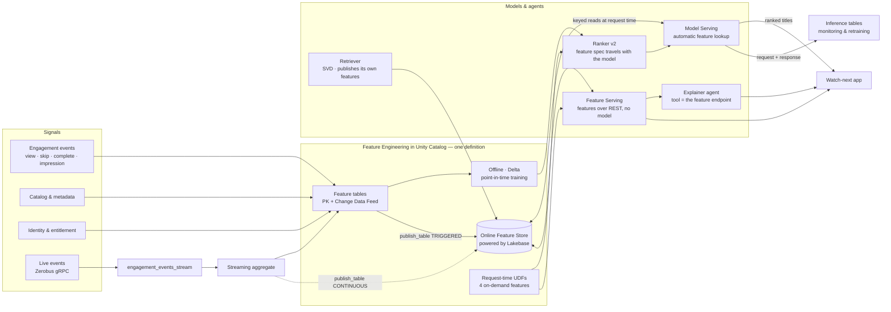

# Crunchyroll · Online Feature Store on Lakebase — end-to-end

45–60 minutes · customer-facing · Databricks Feature Engineering in Unity Catalog +
Lakebase Online Feature Store + Model Serving + Databricks Apps

**From viewer signals to the next best anime, with the online store as the spine.**
One set of feature definitions produces point-in-time-correct training data offline
and low-latency keyed reads online from Lakebase. Two models read that same online
store. An agent explains a recommendation by reading the same governed values. A
streaming path keeps the freshness-critical features current within seconds. And one
command deploys all of it.

Everything claimed here was run on a live workspace. Measurements come with the
command that produced them, and anything not yet verified is listed as not yet
verified — see [docs/verification_log.md](docs/verification_log.md).

## Contents

1. [The problem](#the-problem)
2. [Architecture](#architecture)
3. [Deploy it](#deploy-it)
4. [What runs, in order](#what-runs-in-order)
5. Walkthrough
   - [Step 0 · Raw signals](#step-0--raw-signals)
   - [Step 1 · Define once, publish to Lakebase](#step-1--define-once-publish-to-lakebase)
   - [Step 2 · Point-in-time training](#step-2--point-in-time-training)
   - [Step 3–4 · Serving with automatic feature lookup](#step-34--serving-with-automatic-feature-lookup)
   - [Step 6 · Features the store cannot hold](#step-6--features-the-store-cannot-hold)
   - [Step 7 · Features without a model](#step-7--features-without-a-model)
   - [Step 8 · Two models, one feature layer](#step-8--two-models-one-feature-layer)
   - [Step 5 & 10 · Freshness, measured](#step-5--10--freshness-measured)
   - [Step 12 · An agent on the feature store](#step-12--an-agent-on-the-feature-store)
   - [The app](#the-app)
   - [Step 13 · Operating it](#step-13--operating-it)
6. [Cost, and stopping it](#cost-and-stopping-it)
7. [Repo layout](#repo-layout)
8. [What this demo does not do](#what-this-demo-does-not-do)
9. [Going deeper](#going-deeper)

---

## The problem

Every Crunchyroll surface asks the same question: given this viewer, this session and
this catalog, what should we show next? Genre affinity builds over months. A skip
matters within seconds. One pipeline cannot serve both, so teams build the feature
joins twice — once for training, once for serving — and every divergence between the
two is silent damage to the model in production.

The fix is to **define a feature once and use it everywhere**: the same governed
definitions feed historically correct training data (offline, Delta in Unity Catalog)
and low-latency keyed reads (online, Lakebase), and the serving endpoint retrieves
features itself because the feature spec travels inside the registered model.

## Architecture


Editable source: [`architecture/feature-store-architecture.drawio`](architecture/feature-store-architecture.drawio)
(the PNG and SVG both embed the diagram XML, so either opens in draw.io).

<details>
<summary>Same diagram as Mermaid, with the streaming and agent paths spelled out</summary>



</details>

Freshness is chosen **per feature class**, never globally:

| Feature class | Table | Examples | Offline | Online |
|---|---|---|---|---|
| Long-horizon viewer | `viewer_features_ts` → `viewer_features_current` | genre affinity (8), completion propensity, habitual watch hour | PIT training | latest keyed values |
| Recent behaviour | `recent_behavior_current` | minutes 24h, skips 24h, last genre, last-event epoch | periodic recompute | TRIGGERED refresh |
| Live session | `session_features_current` | session seconds, skips, event count | streaming aggregate | **CONTINUOUS** sync |
| Title & catalog | `title_features` | popularity 30d, rating, recency, genre flags | training + retrieval | candidate context |
| Retrieval embedding | `viewer_embedding_current` | 8 SVD viewer factors | training | keyed lookup by the retriever |
| **Request-time** | none — 4 UC Python UDFs | affinity×genre, affinity×popularity, hour affinity, session decay | computed in the training set | **computed inside the endpoint** |
| Policy & entitlement | `entitlements` | territory, tier, maturity | — | hard filter before scoring |

## Deploy it

Prerequisites: a serverless Databricks workspace with the Online Feature Store
(Lakebase) enabled, and the Databricks CLI ≥ 1.14 authenticated against it.

```bash
make preflight              # is the workspace ready? prints the generated ids you need
make deploy                 # bundle: jobs, checkpoint volume, dashboard
make demo                   # run the whole pipeline (about 45 minutes)
make deploy-app             # create the app, deploy it, grant it Postgres access
make verify                 # assert the demo is presentable
make cost                   # what it is billing right now
make teardown-cost          # stop the money, keep the data
```

Everything is parameterised — catalog, schema, online-store name, all four endpoint
names, warehouse, app name, the demo's end date. `databricks.yml` holds the defaults;
override per target or on the command line. Notebooks also declare each value as a
widget, so any of them still runs standalone from the workspace UI.

Two things the bundle deliberately does not own, with the reasons in the files:
the **online store** (`fe.create_online_store` must own the Lakebase project, and
there is no DAB resource for it) and the **app** (CLI v1.14.1 cannot update an
existing app — see [docs/risks.md](docs/risks.md); `scripts/deploy_app.sh` uses the
supported API instead).

## What runs, in order

`crfs_end_to_end` is one job whose run page is the demo artifact.

```
00 generate_data → 01 build_features → ┬─ 02b pit_probe
                                       ├─ 02 train_ranker → 03 deploy_ranker → 04 smoke_query
                                       │        → 06 ondemand_features → ┬ 03 deploy_ranker_v2 → 05 freshness_triggered
                                       │                                 └ 07 feature_serving
                                       └─ 08 train_retriever
                                                     all → 13 ops_report
```

Satellites: `crfs_streaming` (producer ‖ streaming aggregate + CONTINUOUS publish),
`crfs_event_burst` (the app's button), `crfs_agent`, `crfs_teardown`.

| # | Notebook | What it establishes |
|---|---|---|
| 00 | `00_data_generation.py` | Synthetic catalog, viewers, entitlements, 90 days of engagement, plus an empty live-events table |
| 01 | `01_feature_engineering.py` | Four feature tables, the Lakebase online store, three published online tables |
| 02b | `02b_pit_probe.py` | Point-in-time correctness, standalone |
| 02 | `02_train_ranker.py` | PIT training set, ranker v1, feature spec inside the model |
| 03 | `03_deploy_ranker_endpoint.py` | Serving endpoint + AI Gateway inference table (runs twice: v1, then v2) |
| 04 | `04_query_ranker.py` | Keys and context in, ranked titles out; honest latency numbers |
| 06 | `06_ondemand_features.py` | Four UC Python UDFs, retrain to ranker v2 |
| 07 | `07_feature_serving.py` | Feature spec + Feature Serving endpoint, no model in the path |
| 08 | `08_retrieval_ranker.py` | SVD retriever, its own published feature table, the funnel |
| 05 | `05_freshness_triggered.py` | TRIGGERED freshness: event → feature → online → different ranking |
| 10 | `10_streaming_continuous.py` | CONTINUOUS freshness with a measured event→online latency |
| 11 | `11_event_producer.py` | Event producer: burst, loop, or Zerobus gRPC |
| 12 | `12_agent_explain.py` | Agent whose tool is the Feature Serving endpoint |
| 13 | `13_ops_and_cost.py` | Sync health, capacity, verified cost |
| 99 | `99_teardown.py` | Stop the money, from the UI |

---

## Step 0 · Raw signals

132 recognisable anime titles, 300 viewers with latent genre affinities, an
entitlement matrix (tier × territory × maturity), and 90 days of impressions, plays,
skips and completes generated with real signal so the model has something honest to
learn.

History ends **yesterday** by default. The first version of this demo hardcoded
2026-08-31, so by the time it was presented the "last 24 hours" online features were a
week older than the wall clock the freshness beat used. `make verify` now fails if
that drifts again.


> "Nothing here is feature-store specific yet. Viewing events, catalog metadata,
> entitlements — the governed raw signals any media company already has."

## Step 1 · Define once, publish to Lakebase

`01_feature_engineering.py` builds four feature tables from definitions that live in
`src/crfs/features.py` — imported here and by notebooks 05 and 10. That sharing is not
tidiness: the first version re-derived the recent-behaviour maths separately in 01 and
05, which is exactly the training/serving skew this demo argues against, committed in
its own source.

- Primary keys, non-null, Change Data Feed — the contract an online store needs
- `fe.create_online_store(name=..., capacity="CU_1")` provisions a managed Lakebase project
- `fe.publish_table(..., publish_mode="TRIGGERED")` syncs current values online
- The wait is `ops.wait_for_sync`, which polls
  `GET /api/2.0/database/synced_tables/{name}` until the pipeline reports it processed
  the commit we just wrote — not a `sleep`


The online store is a real Postgres database. Read it the way an application would:

```bash
./scripts/lakebase_explore.sh <profile> <catalog>
# \dt crunchyroll_demo.*
# SELECT viewer_id, minutes_watched_24h, last_primary_genre
#   FROM crunchyroll_demo.online_recent_behavior WHERE viewer_id = 'v0001';
```

Measured two ways, and the gap is the point:

```
Keyed read via Postgres, from in-region compute      n=30  p50   2.7 ms   p95  3.8 ms
Keyed read via Postgres, from a laptop               n=30  p50 240.9 ms   p95 245.5 ms
Same rows via spark.sql on the FOREIGN table               p50 1131 ms
Endpoint query, 25 candidates in one request                    142 ms
```

The single-digit milliseconds are what the serving path actually costs. The laptop
number is network round trip, which is honest but says more about wifi than about
Lakebase. The 1131 ms is serverless SQL planning plus a federated read — the first
version of this demo reported *that* as online-store latency, and it is roughly 420×
the truth.

One gotcha worth knowing: connect to the endpoint's **direct** host. The
`read_write_pooled_host` rejects OAuth tokens with `SASL authentication failed`.

## Step 2 · Point-in-time training

`02_train_ranker.py` opens with the proof: a sample of impressions joined against
`viewer_features_ts` with `timestamp_lookup_key="ts"`, printing feature values **at
impression time** beside today's values.


> "Those two columns differ because the viewer kept watching after that impression.
> The model trains on what we knew *then*. Hand-built training joins get this wrong
> constantly, and it always flatters the offline metrics."

Then `fe.log_model(..., training_set=..., registered_model_name=...)` registers the
ranker in Unity Catalog **with the feature spec inside it**.


## Step 3–4 · Serving with automatic feature lookup

`03_deploy_ranker_endpoint.py` creates the endpoint with AI Gateway inference tables
enabled. No serving code touches a feature table — the registered model already knows
what it needs and where it lives.


`04_query_ranker.py` plays the application. It sends only this:

```json
{"viewer_id": "v0xxx", "title_id": "t0042", "surface": "post_play",
 "device": "tv", "locale": "en-US", "hour_of_day": 21, "request_epoch_s": 1788...}
```


**On latency, honestly.** This notebook used to time `spark.sql()` against the FOREIGN
online table and report ~1 s as "online keyed read latency". That number was
serverless SQL planning plus a federated read; it never touched the serving path. It
now reports three separately labelled numbers: the endpoint round trip, a psycopg
keyed read, and — for contrast only — the SQL-console read.

## Step 6 · Features the store cannot hold

Some features cannot be precomputed. `06_ondemand_features.py` adds four UC **Python**
UDFs, evaluated inside the endpoint after the online lookups:

| Output | Why it must be on demand |
|---|---|
| `affinity_match` | viewer × title cross — precomputing means one row per viewer per title |
| `affinity_x_popularity` | the same cross, scaled by popularity |
| `hour_affinity` | `hour_of_day` only exists in the request |
| `session_decay` | depends on the wall clock at request time |

Verified behaviour (2026-09-07), including the cases that matter:

```
match_scifi          0.3       affinity for the title's genre
match_action         0.4
cross_pop            0.42      = 0.3 × (0.5 + 0.9)
hour_near            0.8625    request 21:00 vs habit 21:30
hour_far             0.0375    request 09:00 vs habit 21:30
hour_wrap_2h         0.75      23:00 vs 01:00 → two hours apart, not twenty-two
decay_10min          0.7165    exp(-10/30)
decay_clamped        0.0       older than 24h
decay_null           0.0       missing key → no exception
match_all_null       0.0
```

Result of adding them, reported as measured: holdout AUC **0.6696** for v2 against
**0.6643** for v1, so **+0.0053** on 61,222 training and 7,302 holdout rows, with 38
numeric plus 4 categorical features. A small lift on synthetic data. The claim this
demo makes is about the mechanism — features that cannot be precomputed still travel
with the model and are evaluated inside the endpoint — not about the number.

Two things to say out loud: the label frame gains
`request_epoch_s = unix_timestamp(event_ts)`, which is the point-in-time-correct
definition of the request clock; and `request_epoch_s` stays **out** of the model's
feature list — only `session_decay` enters, or the model learns absolute time and rots.

Every UDF guards `None` explicitly, because FeatureFunction inputs arrive as NaN
online and `None` in batch when a lookup key is missing, and an unguarded UDF raises
*inside model serving*. Bodies are written without indented blocks — leading
whitespace does not survive the round trip into the function body, which turns an
indented `return` into an `IndentationError` at query time.

## Step 7 · Features without a model

`07_feature_serving.py` creates a feature spec and a **Feature Serving endpoint**:
keys in, feature values out, no model in the path. For when the scoring model lives
outside Databricks, or the application needs the values for its own logic.

The response carries the stored Lakebase values *and* the request-time UDF outputs,
and the notebook shows them matching a direct Postgres keyed read.

Two API shapes that are easy to get wrong: `served_entities` takes a **single
`ServedEntity`**, not a list; and the response arrives under **`outputs`**, not
`predictions` — reading `resp.predictions` gets you `None`.

Verified by querying it three times with identical stored features and different
request context:

```
hour_of_day=21, now        hour_affinity 0.5244   session_decay 0.1629    350 ms
hour_of_day=9,  now        hour_affinity 0.2335   session_decay 0.1629    343 ms
hour_of_day=21, 6h ago     hour_affinity 0.5244   session_decay 1.0000    343 ms
affinity_match holds at 0.0601 throughout — same viewer, same title.
```

That is the proof the UDFs run inside the endpoint rather than being baked in. It also
returns `minutes_watched_24h: 142.0` and `last_primary_genre: 'sci_fi'` — the exact row
the freshness demo wrote, reached through a different access path.

And the negative test: `viewer_id='v9999_does_not_exist'` comes back with
`minutes_watched_24h: None`, `affinity_match: 0.0`, `session_decay: 0.0`. Graceful,
because every UDF guards `None`. An unguarded one raises inside model serving and the
caller sees a 500.

## Step 8 · Two models, one feature layer

`08_retrieval_ranker.py` adds retrieval: truncated SVD (8 components) on the implicit
play matrix, restricted to the same training window as the ranker so there is no
leakage.

The payoff is where the viewer factors go — into `viewer_embedding_current`, a
governed feature table published to Lakebase by the same path as everything else. The
retrieval model's own representation is a feature. Item factors are baked into the
model artifact; at Crunchyroll's catalogue size that side moves to Vector Search and
the request contract does not change.

Recall@60 is reported against a popularity-only baseline and against random. If SVD
does not beat popularity on this synthetic data, the notebook says so and popularity
stays the baseline arm.

The funnel is orchestrated by the application, not by a wrapper model — retriever,
then the entitlement filter, then the ranker, with a latency chip per hop.

## Step 5 & 10 · Freshness, measured

Two notebooks, two publish modes, one contract.

`05_freshness_triggered.py` — **TRIGGERED**: reset a viewer to a calm baseline, rank
25 candidates, complete three sci-fi episodes *now*, recompute, refresh, rank again.
A refresh per change, which is right for a feature that moves a few times a day.

Measured on the run that produced this README:

```
online row BEFORE    38.5 min · slice_of_life · 2 titles
online row AFTER    142.0 min · sci_fi        · 3 titles
17 of 25 candidates re-scored · max |delta| 0.0271
TRIGGERED sync 39.3 s wall clock · keyed read 3 ms · queries 147 ms then 138 ms
```

The top pick held (*Mushoku Tensei* before and after) — the ordering underneath moved,
number one did not. Say that rather than implying a reshuffle; the claim is that an event
landing now changes the next scoring pass, not that it always changes the winner.

The notebook **fails** if the online row did not change. An earlier version passed green
with a delta of exactly 0.0, because the sync wait could be satisfied by the *previous*
completed sync and the endpoint then re-ranked against stale features. A demo that
silently compares identical inputs is worse than one that breaks.


`10_streaming_continuous.py` — **CONTINUOUS**: a streaming aggregate maintains session
features and the sync pipeline keeps Lakebase current with no refresh call at all.
Events arrive via Zerobus gRPC, straight into Delta.

**How the freshness number is produced.** Every event carries `produced_epoch_ms`, the
producer's own clock, and that value is aggregated forward into the online row. A
psycopg reader polls the keyed row until it sees that value, then subtracts. Both ends
of the subtraction are the same clock, so there is no skew argument — and the poll
interval is reported alongside, because it quantises the answer. The notebook also
prints the platform's own decomposition from the synced-table API
(`delta_commit_timestamp` versus `sync_end_timestamp`).

Zerobus writes to **Delta only** — it cannot write to Lakebase Postgres, and the
published online tables are read-only there because the sync pipeline owns them. Why
this demo does not use Stream Feature Views, Real-Time Mode, or the native Postgres
sink is answered concretely in [docs/streaming_paths.md](docs/streaming_paths.md).

## Step 12 · An agent on the feature store

`12_agent_explain.py` logs an MLflow agent with three tools. The interesting one calls
the **Feature Serving endpoint**, so the LLM reads the same governed Lakebase values
the ranker read, including the request-time UDF outputs. A second tool re-queries the
ranker, so counterfactuals ("would it still rank first on mobile at 8am?") are
answered by asking, not by guessing. The system prompt requires it to quote the
feature values it used and to say when one is missing.

Resources are declared at log time (`DatabricksServingEndpoint`, `DatabricksTable`,
`DatabricksSQLWarehouse`) so the endpoint's principal gets automatic auth passthrough;
an `auth_mode=secret` path with a scoped PAT is the one-parameter fallback.

## The app

A Streamlit app on Databricks Apps, six regions mapping to the demo beats: a sidebar
with a **frozen-vs-real clock** toggle (defaults to frozen, because `session_decay`
would otherwise re-score a demo left idle mid-sentence); the funnel with per-hop
latency; ranked cards with a "Why?" expander that calls the agent; the **raw Lakebase
panel** showing actual rows, the SQL that produced them and a keyed-read latency chip;
a **"watch 3 episodes now"** button that fires the burst job and then polls Postgres
every 250 ms, showing the measured seconds until the online value moved; and an ops
footer reading capacity, sync lag and today's spend live.

If the app's service principal has not been granted read access to the Postgres schema
it degrades to reading the same values through the Feature Serving endpoint and shows a
visible badge. A grant problem never takes the demo down. Run
`./scripts/grant_app_postgres.sh <profile>` — and note that `ALTER DEFAULT PRIVILEGES`
is the part that covers tables published *later*.

## Step 13 · Operating it

`13_ops_and_cost.py` prints one operator table per online table — `detailed_state`,
source commit versus processed commit, lag seconds, pipeline state, online versus
offline row counts — then store capacity, endpoint CU bounds, and 14 days of DBU and
dollars per SKU. It also persists its own sync numbers to `crfs_ops_sync_log`, because
dashboards run SQL and cannot call REST.

The AI/BI dashboard (`dashboards/crfs_feature_ops.lvdash.json`) has six datasets, every
query tested against the workspace before it was committed: serving latency
percentiles by served entity, the request mix (which proves the app sends only keys
plus context), score distribution by genre, sync health, feature freshness, and cost.

## Cost, and stopping it

**A Lakebase online store cannot scale to zero.** The docs are blunt about it —
*"Lakebase scale-to-zero is not supported"* and *"Online stores continuously incur costs.
Delete online stores that are no longer needed."* It is the one line that bills while
nobody is watching.

Measured, not estimated:

| | |
|---|---|
| SKU | `ENTERPRISE_DATABASE_SERVERLESS_COMPUTE_US_EAST_N_VIRGINIA` at **$0.52/DBU** |
| At `CU_2` | 30.67 DBU/day = **$15.95/day ≈ $485/month** |
| Endpoint at `CU_2` | min 8 / max 16 CU |
| After moving to `CU_1` | endpoint **min 4 / max 8 CU** — the capacity class governs the floor, `CU_N` → 4N CU |

That last row is the useful finding: changing the capacity class moved the endpoint
bounds by itself, with all three published tables staying
`SYNCED_TABLE_ONLINE_NO_PENDING_UPDATE` throughout. So the class is the lever, not the
endpoint's autoscaling bounds — which is why the bundle does not manage
`postgres_endpoints` by default.

```bash
make cost               # daily DBU and list USD, from system.billing
make teardown-cost      # app, endpoints, online tables, online store. Data untouched.
```

Teardown deletes online tables with `w.feature_store.delete_online_table()` — the docs
call it *"the only recommended method"*, because `DROP TABLE` and the synced-table delete
both leave the table behind in Postgres. Getting that wrong produces the confusing state
where Unity Catalog shows nothing and the next `publish_table` still fails with
`AlreadyExists`.

Full details and the five levers in order: [docs/cost_and_sizing.md](docs/cost_and_sizing.md).

## Repo layout

```
databricks.yml        bundle root: variables, dev/prod targets
Makefile              preflight validate deploy deploy-app demo verify cost teardown-cost
resources/            jobs, checkpoint volume, dashboard  (app is deployed by script, see docs/risks.md)
notebooks/            00-13 plus 99_teardown, the whole pipeline
src/crfs/             config, feature definitions, on-demand UDFs, sync ops, Postgres access
app/                  Streamlit watch-next simulator
dashboards/           AI/BI dashboard, six tested datasets
scripts/              preflight, deploy_app, grants, latency measurement, cost, verify, teardown
docs/                 cost & sizing, streaming paths, risks, verification log
architecture/         the draw.io architecture diagram (png/svg embed the source)
artifacts/            demo_script.md — 12 beats with Say-cues
images/               screenshots from the live workspace
```

## What this demo does not do

Stated plainly so nobody has to guess.

- **No Kafka.** Stream Feature Views (`StreamSource`) require it; the reasoning and the
  alternatives are in [docs/streaming_paths.md](docs/streaming_paths.md).
- **No Feature Views** (the declarative Public Preview API). The feature tables here are
  hand-managed on the GA path.
- **No Real-Time Mode**, and no native `format("postgresql")` streaming sink — the sink
  needs DBR 18.3+ and this workspace tops out at 18.2.
- **No Vector Search.** The retriever's item factors live in the model artifact; the
  README says where that stops scaling.
- **Synthetic data only.** No real Crunchyroll data anywhere.
- **The retriever is not served on an endpoint.** Its features are published to Lakebase
  and its recall is measured, but Unity Catalog rejects the pyfunc's signature and the
  endpoint deployment is skipped. `docs/verification_log.md` records the seven approaches
  tried.
- **No agent run yet.** `12_agent_explain.py` is written against the working Feature
  Serving endpoint but has not been executed.

## Going deeper

**Define & materialize** — [Feature tables in UC](https://docs.databricks.com/aws/en/machine-learning/feature-store/uc/feature-tables-uc) · [Feature Views](https://docs.databricks.com/aws/en/machine-learning/feature-store/feature-views) *(Public Preview)*

**Serve online** — [Online Feature Stores](https://docs.databricks.com/aws/en/machine-learning/feature-store/online-feature-store) · [Automatic feature lookup](https://docs.databricks.com/aws/en/machine-learning/feature-store/automatic-feature-lookup) · [Feature & function serving](https://docs.databricks.com/aws/en/machine-learning/feature-store/feature-function-serving) · [On-demand features](https://docs.databricks.com/aws/en/machine-learning/feature-store/on-demand-features)

**Train & deploy** — [Train recommender models](https://docs.databricks.com/aws/en/machine-learning/train-recommender-models) · [Custom endpoints](https://docs.databricks.com/aws/en/machine-learning/model-serving/create-manage-serving-endpoints) · [Production optimization](https://docs.databricks.com/aws/en/machine-learning/model-serving/production-optimization)

**Operate** — [Monitor endpoints](https://docs.databricks.com/aws/en/machine-learning/model-serving/monitor-diagnose-endpoints) · [AI Gateway inference tables](https://docs.databricks.com/aws/en/ai-gateway/inference-tables-serving-endpoints) · [Lakebase](https://docs.databricks.com/aws/en/oltp/)

Natural next threads: two-tower retrieval with Vector Search feeding this ranker;
Feature Views with managed materialisation replacing the hand-managed refresh in
notebook 01; a real Kafka topic for sub-second Stream Feature Views; traffic splitting
between ranker v1 and v2 adjudicated from the inference tables.

## Provenance

Synthetic data; no real Crunchyroll data. Built and verified on a live Databricks
serverless workspace with Lakebase — see
[docs/verification_log.md](docs/verification_log.md) for what was run, when, and what
it returned, including the bugs the process surfaced. Screenshots from the same
workspace; the ones showing pre-refactor numbers are noted in the verification log.
