# Crunchyroll · Shared feature store, two ranking models, one request path

60–75 minutes · customer-facing · Databricks Feature Engineering in Unity Catalog +
Lakebase Online Feature Store + Model Serving + Databricks Apps

**Vertical ranking decides which rails go on the homepage. Horizontal ranking decides
which titles go inside them. They share one feature layer.**

One set of feature definitions produces point-in-time-correct training data offline
and low-latency keyed reads online from Lakebase. Adding a whole second ranking
model, at a different grain, with a different label, cost **two feature tables and
three request-time UDFs** — nothing was forked and neither model owns a private copy
of a viewer feature. The rail ranker is configured for a request path (no
scale-to-zero, explicit provisioned concurrency, route optimization) and its
latency, throughput, autoscaling and spike behaviour are **measured**, not asserted.

```bash
./setup.sh --profile <PROFILE>     # empty workspace to working demo, one command
```

Everything claimed here was run on a live workspace. Measurements come with the
command that produced them, and anything not yet verified is listed as not yet
verified — see [docs/verification_log.md](docs/verification_log.md).

**Reading for the Crunchyroll DSML ask specifically:**
[docs/ask_alignment.md](docs/ask_alignment.md) — **start here.** A line-by-line audit of
the ask against what was built, with every row marked met / partial / not met and named
to its evidence.
[docs/vertical_ranking.md](docs/vertical_ranking.md) — shared feature store, model
lifecycle, online inference, production serving, and an explicit list of what
Databricks provides versus what Crunchyroll would build and operate.
[docs/serving_benchmark.md](docs/serving_benchmark.md) — the measured serving
numbers, written by the benchmark job rather than by hand.

## Contents

1. [The problem](#the-problem)
2. [Architecture](#architecture)
3. [Deploy it](#deploy-it) · [every parameter](#every-parameter)
4. [What runs, in order](#what-runs-in-order)
5. **[Vertical ranking — the rails themselves](#vertical-ranking--the-rails-themselves)**
6. Walkthrough
   - [Step 0 · Raw signals](#step-0--raw-signals)
   - [Step 1 · Define once, publish to Lakebase](#step-1--define-once-publish-to-lakebase)
   - [Step 2 · Point-in-time training](#step-2--point-in-time-training)
   - [Step 3–4 · Serving with automatic feature lookup](#step-34--serving-with-automatic-feature-lookup)
   - [Step 6 · Features the store cannot hold](#step-6--features-the-store-cannot-hold)
   - [Step 7 · Features without a model](#step-7--features-without-a-model)
   - [Step 8 · Two models, one feature layer](#step-8--two-models-one-feature-layer)
   - [Step 5 & 10 · Freshness, measured](#step-5--10--freshness-measured)
   - [Step 12 · An agent on the feature store](#step-12--an-agent-on-the-feature-store)
   - [The app](#the-app)
   - [Step 13 · Operating it](#step-13--operating-it)
7. [Cost, and stopping it](#cost-and-stopping-it)
8. [Repo layout — every file](#repo-layout--every-file)
9. [Screenshots](#screenshots) — what exists, and what is still missing
10. [What this demo does not do](#what-this-demo-does-not-do)
11. [Going deeper](#going-deeper)

---

## The problem

Every Crunchyroll surface asks the same question: given this viewer, this session and
this catalog, what should we show next? Genre affinity builds over months. A skip
matters within seconds. One pipeline cannot serve both, so teams build the feature
joins twice — once for training, once for serving — and every divergence between the
two is silent damage to the model in production.

The fix is to **define a feature once and use it everywhere**: the same governed
definitions feed historically correct training data (offline, Delta in Unity Catalog)
and low-latency keyed reads (online, Lakebase), and the serving endpoint retrieves
features itself because the feature spec travels inside the registered model.

## Architecture


Editable source: [`architecture/feature-store-architecture.drawio`](architecture/feature-store-architecture.drawio)
(the PNG and SVG both embed the diagram XML, so either opens in draw.io).

<details>
<summary>Same diagram as Mermaid, with the streaming and agent paths spelled out</summary>

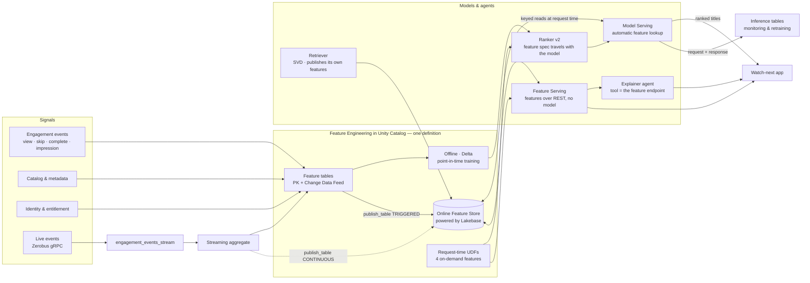

</details>

Freshness is chosen **per feature class**, never globally:

| Feature class | Table | Examples | Offline | Online |
|---|---|---|---|---|
| Long-horizon viewer | `viewer_features_ts` → `viewer_features_current` | genre affinity (8), completion propensity, habitual watch hour | PIT training | latest keyed values |
| Recent behaviour | `recent_behavior_current` | minutes 24h, skips 24h, last genre, last-event epoch | periodic recompute | TRIGGERED refresh |
| Live session | `session_features_current` | session seconds, skips, event count | streaming aggregate | **CONTINUOUS** sync |
| Title & catalog | `title_features` | popularity 30d, rating, recency, genre flags | training + retrieval | candidate context |
| Retrieval embedding | `viewer_embedding_current` | 8 SVD viewer factors | training | keyed lookup by the retriever |
| **Request-time** | none — 4 UC Python UDFs | affinity×genre, affinity×popularity, hour affinity, session decay | computed in the training set | **computed inside the endpoint** |
| Policy & entitlement | `entitlements` | territory, tier, maturity | — | hard filter before scoring |

## Deploy it

Prerequisites: a serverless Databricks workspace with the Online Feature Store
(Lakebase) enabled, and the Databricks CLI ≥ 1.14 authenticated against it.

One command, from an empty workspace:

```bash
./setup.sh --profile <PROFILE>
```

It discovers or creates the infrastructure, deploys the bundle, runs both pipelines,
deploys the app, benchmarks the endpoint and prints what it measured. Nothing is
pinned to the workspace this was built on: `scripts/bootstrap.sh` resolves the three
ids that differ per workspace — SQL warehouse, Lakebase database resource, billing
endpoint uid — at run time into `.crfs.vars`, which is gitignored and passed to the
bundle as `--var` flags. `--stage <name>` runs one stage; `--skip-bench` and
`--skip-app` trim it.

Or step by step:

```bash
make bootstrap              # discover or create the infrastructure; write .crfs.vars
make deploy                 # bundle: jobs, checkpoint volume, dashboard
make demo                   # horizontal: shared features + watch-next ranker (~35 min)
make vertical               # vertical: rails, rail features, rail ranker (~15 min)
make deploy-app             # create the app, deploy it, grant it Postgres access
make bench                  # measure the rail endpoint under load, in region
make bench-local            # the same benchmark from this laptop, for contrast
make verify                 # assert the demo is presentable
make cost                   # what it is billing right now
make teardown-cost          # stop the money, keep the data
```

Each `make` target and the script behind it:

| Target | Runs | What it does |
|---|---|---|
| `make preflight` | `scripts/preflight.sh` | CLI version, auth, schema write access, warehouse state, online-store state, Lakebase endpoint CU bounds, LLM reachability. Prints `lakebase_db_resource` and the endpoint uid — both are generated at project creation, so they must be discovered, never guessed. |
| `make validate` | `databricks bundle validate --strict` | Catches variable and path errors before anything is created. |
| `make deploy` | `databricks bundle deploy` | Jobs, the `crfs_ops` checkpoint volume, the dashboard. |
| `make deploy-app` | `scripts/deploy_app.sh` then `scripts/grant_app_postgres.sh` | Creates or updates the app through the Apps API, uploads `app/`, then grants its service principal Postgres read access. |
| `make up` | `./setup.sh` | Everything below, in order, with a consent prompt before it creates billable infrastructure. |
| `make bootstrap` | `scripts/bootstrap.sh` | Discovers the catalog, warehouse, online store and Lakebase database resource; creates what is missing; writes `.crfs.vars`. Idempotent. |
| `make demo` | `databricks bundle run crfs_end_to_end` | The horizontal pipeline, one run page. |
| `make vertical` | `databricks bundle run crfs_vertical` | The vertical pipeline: rails, rail features, rail ranker, request-path endpoint, homepage assembly. |
| `make bench` | `databricks bundle run crfs_benchmark` | fanout, concurrency ramp, traffic spike, feature-serving comparison, server-side attribution. Runs in region so the numbers are not measuring your wifi. |
| `make bench-local` | `scripts/benchmark_local.py` | The same code from this laptop. The gap between the two *is* the network. |
| `make bench-pull` | `databricks fs cp` | Copies the benchmark write-up out of the ops volume into `docs/serving_benchmark.md`. |
| `make streaming` | `databricks bundle run crfs_streaming --no-wait` | Event producer plus the streaming aggregate and the CONTINUOUS publish. |
| `make burst` | `databricks bundle run crfs_event_burst` | Three live events at `v0001` — the same job the app's button fires. |
| `make agent` | `databricks bundle run crfs_agent` | Logs and deploys the explainer agent. |
| `make verify` | `scripts/verify.sh` | Asserts the demo is presentable: tables exist, history ends within two days, endpoints are READY, online tables are synced. |
| `make cost` | `scripts/cost.sh` | Daily DBU and list USD from `system.billing.usage` ⨝ `system.billing.list_prices`. |
| `make app-url` / `make app-logs` | `databricks apps get` / `apps logs` | URL and compute state; log tail. |
| `make teardown-cost` | `databricks bundle run crfs_teardown` | Deletes the app, the endpoints, the online tables and the online store. Data untouched. |
| `make teardown` | `scripts/teardown.sh --yes` | Same scope as `teardown-cost`, run from the shell instead of a job, confirmation skipped. Still **keeps all data** |
| — | `./scripts/teardown.sh <profile> --full` | The only path that drops UC tables, models, UDFs and the feature spec. Deliberately not a `make` target |
| `make destroy` | `databricks bundle destroy` | Removes the bundle's own resources. |

`PROFILE` and `TARGET` are overridable on every target:
`make deploy PROFILE=my-workspace TARGET=prod`. `PROFILE` defaults to
`fe-vm-lakebase-praneeth` — change it in the `Makefile` or pass it, but never let a
Databricks command pick a profile for you.

### Every parameter

Nothing in this repo hardcodes a name. Defaults live twice, deliberately: in
`databricks.yml` `variables:` (what jobs pass as task `base_parameters`) and in
`src/crfs/config.py` `DEFAULTS` (what a notebook declares as its own widget when you
run it standalone from the workspace UI). `Config.from_widgets()` declares every widget
and reads them all back, so the two can never silently disagree about which names exist.

| Variable / widget | Default | Notes |
|---|---|---|
| `catalog` | `serverless_lakebase_praneeth_catalog` | |
| `schema` | `crunchyroll_demo` | Also the Postgres schema name inside Lakebase |
| `online_store` | `crunchyroll-online-store` | DNS-compliant: lowercase, hyphens, **no underscores** |
| `online_capacity` | `CU_1` | `CU_N` gives the Lakebase endpoint a 4N CU floor |
| `lakebase_project` / `lakebase_branch` / `lakebase_endpoint` | `crunchyroll-online-store` / `production` / `primary` | `fe.create_online_store` creates all three |
| `lakebase_db_resource` | `projects/…/databases/db-p78x-mcrka97vph` | Generated id — `make preflight` prints yours |
| `ranker_endpoint` | `crunchyroll-watch-next-ranker` | Horizontal (titles). Demo config: `Small`, scale-to-zero on |
| `rail_ranker_endpoint` | `crunchyroll-rail-ranker` | Vertical (rails). Request-path config: **no scale-to-zero**, provisioned concurrency 4–32, route optimized |
| `retriever_endpoint` | `crunchyroll-candidate-retriever` | Deployed and READY. UC registration needed an explicit `ModelSignature` — see `docs/verification_log.md` V54 |
| `feature_endpoint` | `crunchyroll-viewer-features` | The Feature Serving endpoint, no model in the path |
| `agent_endpoint` | `crunchyroll-explainer-agent` | |
| `llm_endpoint` | `databricks-claude-sonnet-4-5` | Any Databricks-hosted chat endpoint |
| `warehouse_id` | `4d39ac2e32b72a3a` | Used by the dashboard and the agent's `describe_title` tool |
| `end_date` | `""` | Empty means **yesterday**, computed at run time |
| `volume` | `crfs_ops` | Holds the streaming checkpoints |
| `app_name` | `crfs-watch-next` | |

Two things the bundle deliberately does not own, with the reasons in the files:
the **online store** (`fe.create_online_store` must own the Lakebase project, and
there is no DAB resource for it) and the **app** (CLI v1.14.1 cannot update an
existing app — see [docs/risks.md](docs/risks.md); `scripts/deploy_app.sh` uses the
supported API instead).

## What runs, in order

`crfs_end_to_end` is one job whose run page is the demo artifact.

```
00 generate_data → 01 build_features → ┬─ 02b pit_probe
                                       ├─ 02 train_ranker → 03 deploy_ranker → 04 smoke_query
                                       │        → 06 ondemand_features → ┬ 03 deploy_ranker_v2 → 05 freshness_triggered
                                       │                                 └ 07 feature_serving
                                       └─ 08 train_retriever
                                                     all → 13 ops_report
```

Then `crfs_vertical` builds rail ranking on the feature layer this job created — see
[Vertical ranking](#vertical-ranking--the-rails-themselves) for its DAG.

Satellites: `crfs_benchmark` (load-test the rail endpoint, repeatable after any config
change), `crfs_streaming` (producer ‖ streaming aggregate + CONTINUOUS publish),
`crfs_event_burst` (the app's button), `crfs_agent`, `crfs_teardown`.

| # | Notebook | Job task key | What it establishes |
|---|---|---|---|
| 00 | `notebooks/00_data_generation.py` | `generate_data` | Synthetic catalog, viewers, entitlements, 90 days of engagement, plus an empty live-events table |
| 01 | `notebooks/01_feature_engineering.py` | `build_features` | Four feature tables, the Lakebase online store, three published online tables |
| 02b | `notebooks/02b_pit_probe.py` | `pit_probe` | Point-in-time correctness, standalone |
| 02 | `notebooks/02_train_ranker.py` | `train_ranker` | PIT training set, ranker v1, feature spec inside the model |
| 03 | `notebooks/03_deploy_ranker_endpoint.py` | `deploy_ranker`, then `deploy_ranker_v2` | Serving endpoint + AI Gateway inference table. The same notebook runs twice with a different `model_version` |
| 04 | `notebooks/04_query_ranker.py` | `smoke_query` | Keys and context in, ranked titles out; honest latency numbers |
| 06 | `notebooks/06_ondemand_features.py` | `ondemand_features` | Four UC Python UDFs, retrain to ranker v2 |
| 07 | `notebooks/07_feature_serving.py` | `feature_serving` | Feature spec + Feature Serving endpoint, no model in the path |
| 08 | `notebooks/08_retrieval_ranker.py` | `train_retriever` | SVD retriever, its own published feature table, the funnel |
| 05 | `notebooks/05_freshness_triggered.py` | `freshness_triggered` | TRIGGERED freshness: event → feature → online → different ranking |
| 13 | `notebooks/13_ops_and_cost.py` | `ops_report` | Sync health, capacity, verified cost |
| 10 | `notebooks/10_streaming_continuous.py` | `streaming_aggregate` (job `crfs_streaming`) | CONTINUOUS freshness with a measured event→online latency |
| 11 | `notebooks/11_event_producer.py` | `produce_events` (`crfs_streaming`), `burst` (`crfs_event_burst`) | Event producer: burst, loop, or Zerobus gRPC |
| 12 | `notebooks/12_agent_explain.py` | `agent` (job `crfs_agent`) | Agent whose tool is the Feature Serving endpoint |
| 20 | `notebooks/20_rail_data_generation.py` | `rail_data` (job `crfs_vertical`) | Rail catalog, rail × title map, the homepage impression log with position bias, and the measured propensity table |
| 21 | `notebooks/21_rail_features.py` | `rail_features` (`crfs_vertical`) | `rail_features` + `viewer_rail_features_ts`, both published to the same online store; asserts the online copy is one row per key |
| 22 | `notebooks/22_train_rail_ranker.py` | `train_rail_ranker` (`crfs_vertical`) | Point-in-time training set, IPS-weighted fit, NDCG against three baselines plus an ablation, logged with its feature spec and registered |
| 23 | `notebooks/23_deploy_rail_endpoint.py` | `deploy_rail_endpoint` (`crfs_vertical`) | The request-path endpoint — no scale-to-zero, provisioned concurrency, route optimization — and a record of what it actually got |
| 24 | `notebooks/24_homepage_assembly.py` | `homepage_assembly` (`crfs_vertical`) | A whole homepage from both rankers; shared-table overlap resolved from UC; four-context sensitivity check |
| 25 | `notebooks/25_serving_benchmark.py` | `benchmark` (job `crfs_benchmark`) | fanout, concurrency ramp, traffic spike, feature-serving comparison, server-side attribution |
| 99 | `notebooks/99_teardown.py` | `teardown` (job `crfs_teardown`) | Stop the money, from the UI |

Task keys matter in practice: a failure on the run page names the task, and
`databricks bundle run crfs_end_to_end --only <task_key>` re-runs just that one.
Note that `deploy_ranker` and `deploy_ranker_v2` are the *same notebook file* — the only
difference is the `model_version` parameter, which is why the notebook takes it as a
widget instead of resolving "latest" itself.

---

## Vertical ranking — the rails themselves

The homepage is a stack of rails: Continue Watching, This Season's Simulcasts, Top 10
in Your Country, Action & Adventure. **Vertical ranking orders those rails.**
Horizontal ranking orders the titles inside each one. Same viewer, same request, same
feature store — two models with different grains and different labels.

```
00 generate_data ──► 20 rail_data ──► 21 rail_features ──► 22 train_rail_ranker
                                                                    │
                                                       23 deploy_rail_endpoint
                                                                    │
                                                        24 homepage_assembly
                                                     (needs both endpoints)

                     25 serving_benchmark   ── its own job: real load on a live
                                               endpoint, repeatable after any
                                               config change
```

### What it added to the feature layer

| Table | PK | Offline | Online | Shared |
|---|---|---|---|---|
| `viewer_features_current` | viewer_id | latest | ✅ | **reused unchanged** |
| `recent_behavior_current` | viewer_id | triggered | ✅ | **reused unchanged** |
| `title_features` | title_id | daily | ✅ | **reused** (rail content stats) |
| `rail_features` | rail_id | daily | ✅ | new — 16 rows |
| `viewer_rail_features_ts` | viewer_id + rail_id (+ ts) | 421,290 daily snapshots | ✅ **4,681 rows, one per key** | new |

Plus three new request-time UDFs (`cr_rail_taste_match`, `cr_rail_click_recency`,
`cr_device_rail_fit`) and **two reused verbatim** from the watch-next ranker
(`cr_hour_affinity_delta`, `cr_session_decay`).

### One table for offline and online

`viewer_rail_features_ts` is a **time series feature table**, published straight to
the online store. Offline it holds every daily snapshot and the training join is
point-in-time. Publishing it **deduplicates to the latest row per
`(viewer_id, rail_id)`** — measured on this workspace:

```
offline: 421,290 rows across 4,681 (viewer, rail) keys
online:  4,681 rows
one row per key confirmed; online is 90x smaller
```

and the synced table's own spec came back as
`primary_key_columns=[viewer_id, rail_id]`, `timeseries_key=ts`. Notebook 21 asserts
this rather than printing it, because everything the serving path claims depends on
it.

So there is no `viewer_rail_current` mirror. Training and serving read the same table
through the same `FeatureLookup`. That is a stronger statement than "two tables built
from one definition" — the horizontal path still keeps `viewer_features_ts` +
`viewer_features_current`, and collapsing it the same way is the recommendation
written up in [docs/vertical_ranking.md](docs/vertical_ranking.md).

### Position bias, which a homepage ranker cannot skip

Every label in a homepage log was observed at a position the *incumbent* policy
chose. Measured on this data, `P(viewport | position)` falls from **0.97 at position 1
to 0.09 at position 16**. Fit that raw and the model learns the old homepage.

| Mechanism | Where |
|---|---|
| `rail_position_propensity` — measured `P(viewport \| position)` and clipped IPS weights | notebook 20 |
| Clicked rows weighted by `1 / P(viewport \| position)`, clipped at 10× | notebook 22 |
| **Rendered position is never a feature** — at request time it is the output, not an input | notebook 22 |
| AUC reported on all impressions *and* on viewed impressions only | notebook 22 |
| NDCG@3/@5 and MRR per session vs the incumbent editorial order, rail CTR, and random | notebook 22 |
| An ablation that drops the whole rail-identity block, isolating personalization from "a better fixed order" | notebook 22 |

Measured on 511 holdout homepage sessions: **NDCG@5 0.7065 for the ranker against
0.6751 for the incumbent editorial order — +4.7%**; MRR 0.7100 against 0.6770; holdout
AUC 0.6228 on viewed impressions.

The ablation that drops **all 13 rail-identity features** loses nothing — NDCG@5 0.7073,
slightly *up*, Spearman 0.971 confirming the models differ. **So the whole lift is
personalization**, not a better fixed order. Rail-level aggregates score on permutation
importance (an AUC metric) yet cannot reorder rails for one viewer, because within a
session every viewer sees the same rail-level priors. Note the importance *ordering*
between the two new tables is not stable run to run and should not be quoted; the stable
findings are that the two new tables dominate and the shared viewer tables sit at ~zero
for rail ranking. Reconciled, with both runs' numbers, in
[docs/vertical_ranking.md](docs/vertical_ranking.md), along with why the shared viewer
tables contribute ~nothing to *rail* ranking and what that does and does not say about
sharing a feature store.

Those labels come from a latent utility the model can recover, so read the lift as
evidence the pipeline works rather than a forecast of Crunchyroll's lift.

### The request contract

Seven fields per candidate rail. **45** feature values are resolved inside the
endpoint.

```json
{"dataframe_records": [
  {"viewer_id": "v0042", "rail_id": "r_continue", "device": "tv", "locale": "en-US",
   "hour_of_day": 21, "day_of_week": 5, "request_epoch_s": 1789000000},
  {"viewer_id": "v0042", "rail_id": "r_simulcast", "...": "..."}
]}
```

The response comes back **already ranked** — the model sorts within the request,
grouped by `viewer_id` so a batched multi-viewer call cannot mix one viewer's order
into another's:

```json
{"predictions": [
  {"rail_id": "r_continue",  "engagement_probability": 0.4131, "rail_rank": 1},
  {"rail_id": "r_simulcast", "engagement_probability": 0.2884, "rail_rank": 2}
]}
```

Eligibility runs **before** scoring and is a hard filter, not a feature: a viewer
with nothing in progress is not offered Continue Watching and no score can overrule
that. Same discipline as the entitlement join on the horizontal side.

### Configured for a request path

This is the difference between the two endpoints, and it matters more than any model
change:

| Setting | `crunchyroll-rail-ranker` | `crunchyroll-watch-next-ranker` |
|---|---|---|
| `scale_to_zero_enabled` | **false** | true |
| provisioned concurrency | **4 – 32** | — (`workload_size: Small`) |
| `route_optimized` | **true** (create-time only) | false |
| inference table | `cr_rail_inference` | `cr_ranker_inference` |

`workload_size` and the provisioned-concurrency pair are mutually exclusive in the
API. Notebook 23 asks for the explicit pair, falls back to `workload_size` if the
workspace rejects it, and **records which one it actually got** — a latency table is
unfalsifiable without it. `verify.sh` fails if `scale_to_zero` is not disabled.

### Measured under load

`make bench` runs five phases as a job inside the region, and writes both a UC table
(`crfs_serving_benchmark`, one row per phase with the endpoint config beside it) and
a markdown write-up. `make bench-local` runs the identical code from a laptop.

| Phase | Question |
|---|---|
| `fanout` | Marginal latency per additional candidate rail — each one is another pair of online lookups inside the same call |
| `ramp` | Percentiles and achieved req/s at concurrency 1→64, with error codes counted rather than swallowed |
| `spike` | Step from 2 to 48 concurrent with no ramp: first-second p95, seconds to recover, anything rejected |
| `features_only` | The same fanout against Feature Serving — the online-lookup share, measured |
| `server_side` | `execution_time_ms` from the inference table, which excludes the network |

Numbers live in [docs/serving_benchmark.md](docs/serving_benchmark.md). They are not
repeated here on purpose: a latency number copied by hand into a README is a latency
number that will be wrong by next week.

---

## Step 0 · Raw signals

`notebooks/00_data_generation.py` writes five tables into
`serverless_lakebase_praneeth_catalog.crunchyroll_demo`, every one with Change Data Feed
enabled:

| Table | Rows | What it is |
|---|---|---|
| `titles` | 132 | Recognisable anime titles with `primary_genre`, `franchise`, `episode_count`, `is_simulcast` and 8 genre flags |
| `viewers` | 300 | Viewers with latent genre affinities, a tier and a territory |
| `entitlements` | 39,600 | The 300 × 132 matrix of tier × territory × maturity rights — a hard filter, never a feature |
| `engagement_events` | ≈107,000 | 90 days of impressions, plays, skips and completes, generated with real signal so the model has something honest to learn |
| `engagement_events_stream` | 0 at first | The live-event landing table, seeded empty. Columns: `event_id`, `viewer_id`, `title_id`, `event_ts`, `event_type`, `watch_seconds`, `surface`, `device`, `locale`, `produced_epoch_ms` |

`engagement_events_stream` exists so live events never touch the training corpus. The
first version of this demo appended `burst-*` rows straight into `engagement_events`,
which mutated the corpus every time the freshness beat ran, so training stopped being
reproducible. `produced_epoch_ms` on that table is the producer's own clock, carried
all the way through to the online row — subtracting two readings of that single clock is
how the streaming freshness number avoids a clock-skew argument.

History ends **yesterday** by default (`end_date=""` resolves through
`Config.end_date_resolved` in `src/crfs/config.py`). The first version of this demo
hardcoded `END_DATE = "2026-08-31"`, so by the time it was presented the "last 24
hours" online features were a week older than the wall clock the freshness beat used.
`scripts/verify.sh` now fails if `max(event_ts)` falls more than two days behind
`current_date`.

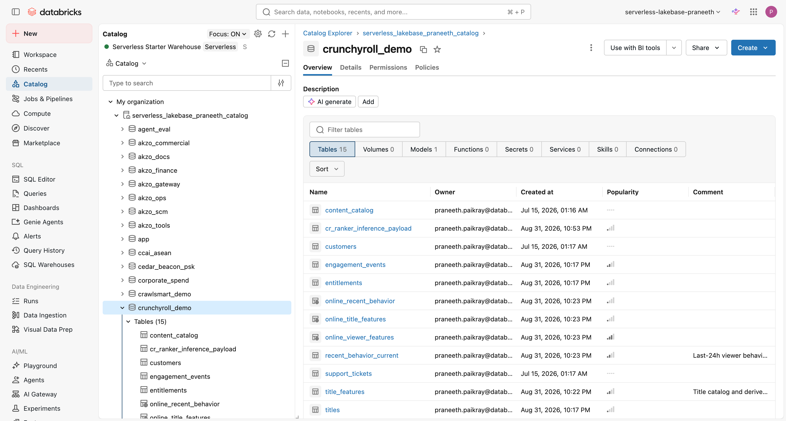
*`images/01-catalog-explorer.png` — the schema in Catalog Explorer.*

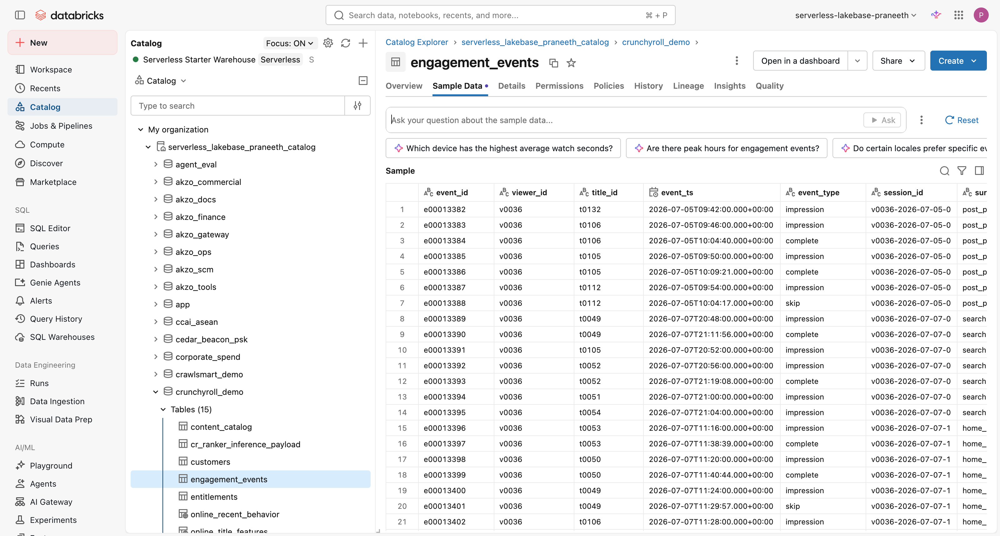
*`images/02-events-table.png` — `engagement_events` sample rows.*

> "Nothing here is feature-store specific yet. Viewing events, catalog metadata,
> entitlements — the governed raw signals any media company already has."

## Step 1 · Define once, publish to Lakebase

`notebooks/01_feature_engineering.py` builds four feature tables from definitions that
live in `src/crfs/features.py` — imported here and by `05_freshness_triggered.py` and
`10_streaming_continuous.py`. That sharing is not tidiness: the first version re-derived
the recent-behaviour maths separately in 01 and 05, which is exactly the
training/serving skew this demo argues against, committed in its own source.

The four functions that define every offline value:

| Function in `src/crfs/features.py` | Produces | Feature table |
|---|---|---|
| `build_viewer_timeseries()` | Daily snapshots: 8 genre affinities, completion propensity, `typical_watch_hour`, `hour_concentration`, 7/30-day rolling windows | `viewer_features_ts` (PK `viewer_id, ts`, `timeseries_column="ts"`) |
| `viewer_current_from_ts()` | The latest row per viewer, taken from the same time series so offline and online cannot diverge | `viewer_features_current` |
| `build_title_features()` | `popularity_30d`, rating, recency, 8 genre flags | `title_features` |
| `build_recent_behavior()` | `minutes_watched_24h`, `skips_24h`, `active_titles_24h`, `last_primary_genre`, `last_event_epoch_s` | `recent_behavior_current` |

`typical_watch_hour` is a **circular** mean — hours are on a clock, so the average of
23:00 and 01:00 is midnight, not noon. It is computed with `sin`/`cos` and `atan2`, and
`hour_concentration` is the resultant length, which doubles as a confidence weight for
the `hour_affinity` UDF in step 6.

What notebook 01 then does, in order:

- **Primary keys, non-null, Change Data Feed** — the contract an online store needs.
  `upsert_feature_table()` (defined in the notebook) writes with
  `fe.write_table(mode="merge")` when the schema is unchanged, and drops and recreates
  only when the column set actually changed — deleting the dependent synced table first,
  via `ops.drop_synced_if_exists()`. The first version dropped unconditionally, which
  destroyed the source of a live synced table on every re-run.
- `fe.create_online_store(name="crunchyroll-online-store", capacity="CU_1")` provisions
  a managed Lakebase project, its `production` branch and its `primary` endpoint.
- `fe.publish_table(..., publish_mode="TRIGGERED")` for the three tables listed in the
  notebook's `PUBLISH` list → `online_viewer_features`, `online_title_features`,
  `online_recent_behavior`.
- The publish itself goes through `ops.publish_or_refresh()`, because `publish_table` is
  a **create**, not an upsert: called twice it raises `AlreadyExists`. That helper
  publishes the first time and calls the synced-table refresh every time after.
- The wait is `ops.wait_for_sync()` / `ops.refresh_and_wait()`, which poll
  `GET /api/2.0/database/synced_tables/{full_name}` until
  `triggered_update_status.last_processed_commit_version` reaches the commit version
  `ops.source_commit_version()` read from `DESCRIBE HISTORY` — not a `sleep`. There is
  no `time.sleep()` left anywhere in the pipeline; the first version had about four
  minutes of it.

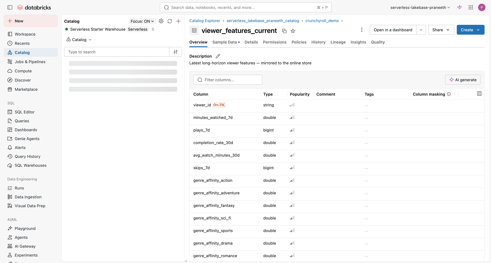
*`images/03-feature-table-viewer.png` — `viewer_features_current` in Catalog Explorer,
showing the primary key and the feature-table badge.*

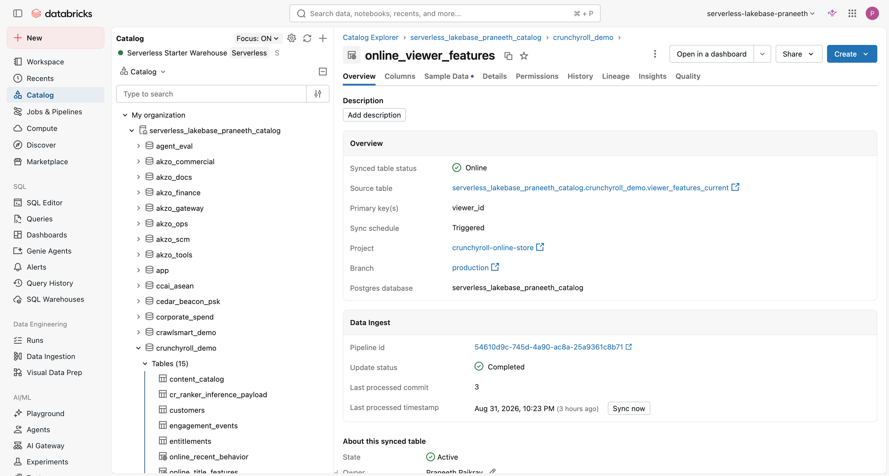
*`images/04-online-tables.png` — the published online tables and their sync state.*

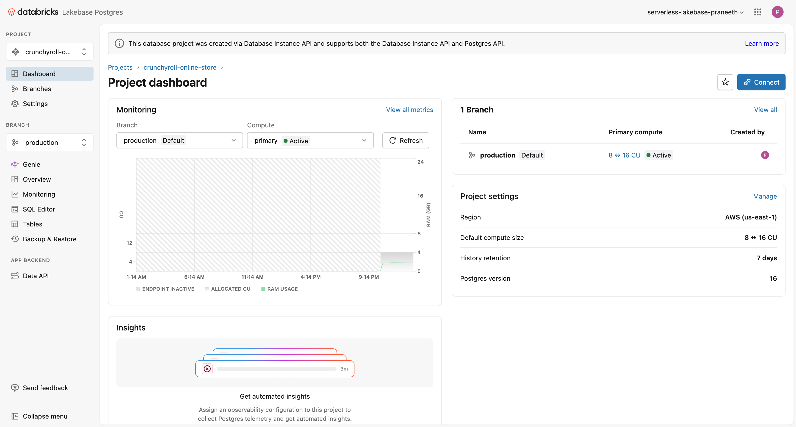
*`images/13-lakebase-project.png` — the Lakebase project `crunchyroll-online-store`
that `fe.create_online_store` provisioned.*

The online store is a real Postgres database. Read it the way an application would —
`scripts/lakebase_explore.sh` opens `psql` with a freshly minted OAuth token:

```bash
./scripts/lakebase_explore.sh <profile> <catalog>
# \dt crunchyroll_demo.*
# SELECT viewer_id, minutes_watched_24h, last_primary_genre
#   FROM crunchyroll_demo.online_recent_behavior WHERE viewer_id = 'v0001';
```

From Python, `src/crfs/online.py` is the same access path used by the app, the latency
measurement and the freshness poller. `OnlineStore.keyed_read()` does one keyed
`SELECT`, `keyed_read_latency()` times a batch of them, and `wait_for_value()` polls
until a column reaches a target — that last one is what makes the streaming latency
measurable. `scripts/measure_online_latency.py` is the standalone laptop version.

Measured two ways, and the gap is the point:

```
Keyed read via Postgres, from in-region compute      n=30  p50   2.7 ms   p95  3.8 ms
Keyed read via Postgres, from a laptop               n=30  p50 240.9 ms   p95 245.5 ms
Same rows via spark.sql on the FOREIGN table               p50 1131 ms
Endpoint query, 25 candidates in one request                    142 ms
```

The single-digit milliseconds are what the serving path actually costs. The laptop
number is network round trip, which is honest but says more about wifi than about
Lakebase. The 1131 ms is serverless SQL planning plus a federated read — the first
version of this demo reported *that* as online-store latency, and it is roughly 420×
the truth.

One gotcha worth knowing: connect to the endpoint's **direct** host. The
`read_write_pooled_host` rejects OAuth tokens with `SASL authentication failed`.

## Step 2 · Point-in-time training

`notebooks/02_train_ranker.py` opens with the proof: a sample of impressions joined
against `viewer_features_ts` with `timestamp_lookup_key="ts"`, printing feature values
**at impression time** beside today's values.
`notebooks/02b_pit_probe.py` is the same proof standalone, so it can be shown without
the training run around it.

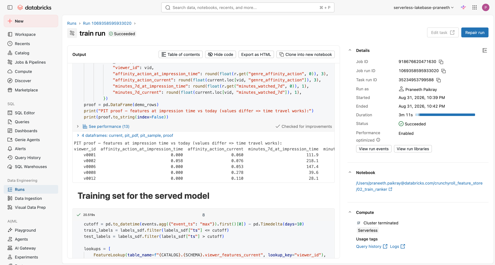
*`images/06-pit-proof.png` — the same feature, as of impression time and as of now.*

> "Those two columns differ because the viewer kept watching after that impression.
> The model trains on what we knew *then*. Hand-built training joins get this wrong
> constantly, and it always flatters the offline metrics."

Then `fe.create_training_set()` assembles the PIT-correct frame from `FeatureLookup`s
against `viewer_features_ts`, `title_features` and `recent_behavior_current`, and
`fe.log_model(..., training_set=..., registered_model_name=...)` registers the ranker in
Unity Catalog **with the feature spec inside it**. That is the mechanism the whole demo
rests on: at serving time nothing in the request has to name a feature table, because
the model already carries the lookup graph.

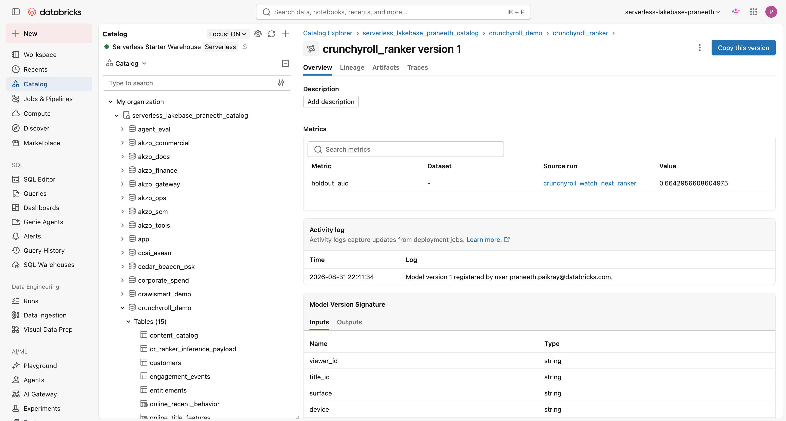
*`images/08b-model-version-spec.png` — the registered model version with its embedded
feature spec.*

## Step 3–4 · Serving with automatic feature lookup

`notebooks/03_deploy_ranker_endpoint.py` creates the endpoint
`crunchyroll-watch-next-ranker` with AI Gateway inference tables enabled, writing
requests and responses to `cr_ranker_inference_payload`. No serving code touches a
feature table — the registered model already knows what it needs and where it lives.
The notebook takes `model_version` as a widget and is idempotent, retrying on
`ResourceConflict`, which is what lets the spine call it twice (`deploy_ranker` for v1,
`deploy_ranker_v2` after the on-demand features land).

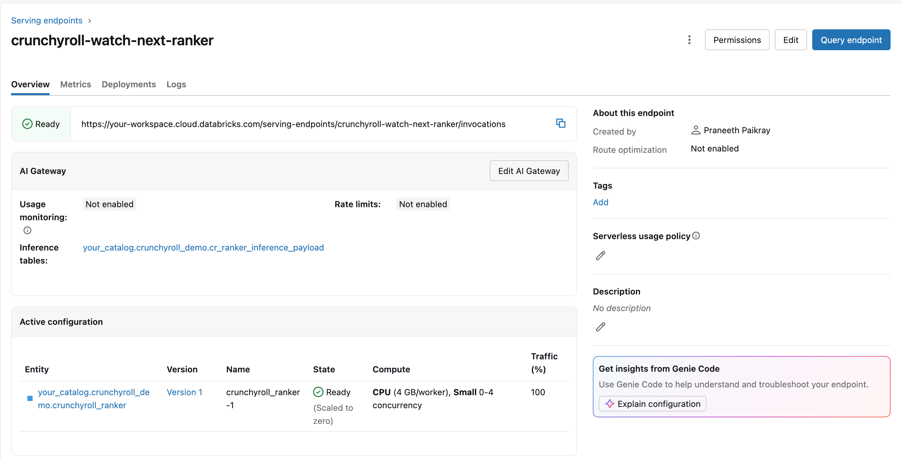
*`images/09-endpoint-ready.png` — the ranker endpoint READY, with inference tables on.*

`notebooks/04_query_ranker.py` plays the application, building its request through
`src/crfs/candidates.py` — `candidates()` picks the 25 titles, `request_records()`
builds the payload, `query_ranker()` sends it and `rank()` sorts the response. The app
and the agent use those same four functions, so there is exactly one definition of what
a request looks like. It sends only this:

```json
{"viewer_id": "v0xxx", "title_id": "t0042", "surface": "post_play",
 "device": "tv", "locale": "en-US", "hour_of_day": 21, "request_epoch_s": 1788...}
```

Seven fields — `REQUEST_KEYS` in `src/crfs/candidates.py`. No feature values, no feature
names, no table names — the
endpoint fetches 38 numeric and 4 categorical features from Lakebase itself and computes
four more at request time.

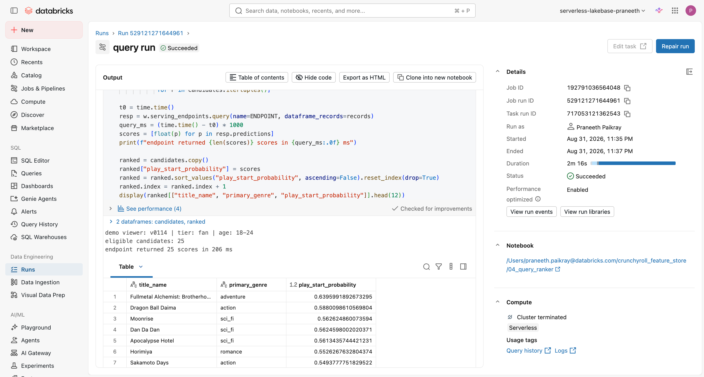
*`images/10-query-ranked.png` — 25 candidates in, ranked titles out.*

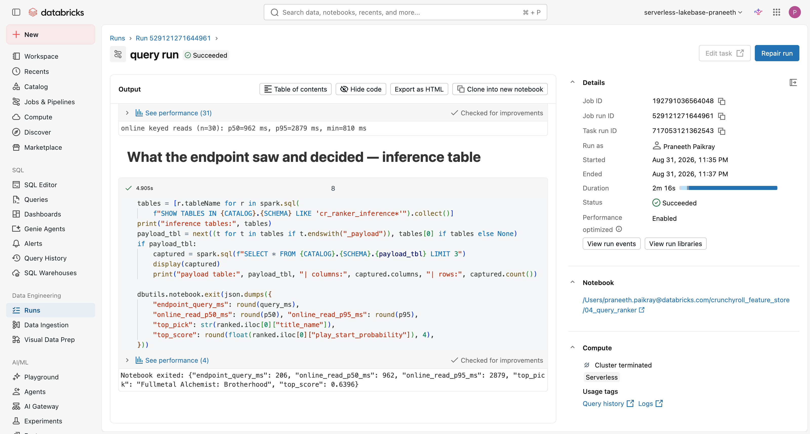
*`images/11-inference-table.png` — `cr_ranker_inference_payload`, the AI Gateway
inference table, which is also the retraining corpus and the dashboard's source.*

**On latency, honestly.** This notebook used to time `spark.sql()` against the FOREIGN
online table and report ~1 s as "online keyed read latency". That number was
serverless SQL planning plus a federated read; it never touched the serving path. It
now reports three separately labelled numbers: the endpoint round trip, a psycopg
keyed read, and — for contrast only — the SQL-console read.

## Step 6 · Features the store cannot hold

Some features cannot be precomputed. `notebooks/06_ondemand_features.py` creates four
UC **Python** UDFs from the DDL generated by `src/crfs/udfs.py` (`udfs.ddl(fq)` emits
them, `udfs.feature_functions(fq)` returns the matching `FeatureFunction` list), and they
are evaluated inside the endpoint after the online lookups:

| UDF (three-level name in your schema) | Output feature | Why it must be on demand |
|---|---|---|
| `cr_genre_affinity_match` | `affinity_match` | viewer × title cross — precomputing means one row per viewer per title, 39,600 rows here and billions at real scale |
| `cr_affinity_popularity_cross` | `affinity_x_popularity` | the same cross, scaled by `popularity_30d` |
| `cr_hour_affinity_delta` | `hour_affinity` | `hour_of_day` only exists in the request; the circular distance is weighted by `hour_concentration` |
| `cr_session_decay` | `session_decay` | `exp(-minutes/30)`, clamped at 1440 minutes, from the wall clock at request time |

They reach the model through `fe.create_training_set(feature_lookups=lookups + on_demand)`
— note that the `FeatureFunction`s go into the **same** `feature_lookups` list. There is
no `feature_functions=` keyword argument, which is an easy hour to lose.

Three encoding rules are baked into `src/crfs/udfs.py`, each one learned the hard way and
commented there:

- **`BIGINT`, not `INT`**, for every genre-flag argument. pandas `int64` lands in Delta as
  `bigint`, and a mismatch fails at training-set creation with
  `FeatureFunction argument column 'genre_action' … has type 'bigint'`.
- **Apostrophes in `COMMENT` are doubled**, or the DDL dies with `PARSE_SYNTAX_ERROR`.
- **Bodies contain no indented blocks** — conditional expressions only. Leading whitespace
  does not survive the round trip into the stored function body, which turns an indented
  `return` into an `IndentationError` at query time, surfacing as `UDF_USER_CODE_ERROR`.

Verified behaviour (2026-09-07), including the cases that matter:

```
match_scifi          0.3       affinity for the title's genre
match_action         0.4
cross_pop            0.42      = 0.3 × (0.5 + 0.9)
hour_near            0.8625    request 21:00 vs habit 21:30
hour_far             0.0375    request 09:00 vs habit 21:30
hour_wrap_2h         0.75      23:00 vs 01:00 → two hours apart, not twenty-two
decay_10min          0.7165    exp(-10/30)
decay_clamped        0.0       older than 24h
decay_null           0.0       missing key → no exception
match_all_null       0.0
```

Result of adding them, reported as measured: holdout AUC **0.6696** for v2 against
**0.6643** for v1, so **+0.0053** on 61,222 training and 7,302 holdout rows, with 38
numeric plus 4 categorical features. A small lift on synthetic data. The claim this
demo makes is about the mechanism — features that cannot be precomputed still travel
with the model and are evaluated inside the endpoint — not about the number.

Two things to say out loud: the label frame gains
`request_epoch_s = unix_timestamp(event_ts)`, which is the point-in-time-correct
definition of the request clock; and `request_epoch_s` stays **out** of the model's
feature list — only `session_decay` enters, or the model learns absolute time and rots.

Every UDF guards `None` explicitly, because FeatureFunction inputs arrive as NaN online
and `None` in batch when a lookup key is missing, and an unguarded UDF raises *inside
model serving* — the caller sees a 500 with no useful detail.

> **Screenshot missing:** `images/05-ondemand-udfs.png` — the four `cr_*` functions in
> Catalog Explorer under **Functions**, or the output of
> `DESCRIBE FUNCTION EXTENDED <catalog>.<schema>.cr_hour_affinity_delta`. See
> [Screenshots](#screenshots).

## Step 7 · Features without a model

`notebooks/07_feature_serving.py` creates a feature spec
(`fe.create_feature_spec(name=..., features=lookups + on_demand)`) and a **Feature
Serving endpoint** named `crunchyroll-viewer-features`: keys in, feature values out, no
model in the path. For when the scoring model lives outside Databricks, or the
application needs the values for its own logic — the app's raw-Lakebase panel falls back
to it, and the agent's `get_viewer_context` tool uses it as its only feature source.

The response carries the stored Lakebase values *and* the request-time UDF outputs,
and the notebook shows them matching a direct Postgres keyed read.

Two API shapes that are easy to get wrong: `served_entities` takes a **single
`ServedEntity`**, not a list; and the response arrives under **`outputs`**, not
`predictions` — reading `resp.predictions` gets you `None`.

Verified by querying it three times with identical stored features and different
request context:

```
hour_of_day=21, now        hour_affinity 0.5244   session_decay 0.1629    350 ms
hour_of_day=9,  now        hour_affinity 0.2335   session_decay 0.1629    343 ms
hour_of_day=21, 6h ago     hour_affinity 0.5244   session_decay 1.0000    343 ms
affinity_match holds at 0.0601 throughout — same viewer, same title.
```

That is the proof the UDFs run inside the endpoint rather than being baked in. It also
returns `minutes_watched_24h: 142.0` and `last_primary_genre: 'sci_fi'` — the exact row
the freshness demo wrote, reached through a different access path.

And the negative test: `viewer_id='v9999_does_not_exist'` comes back with
`minutes_watched_24h: None`, `affinity_match: 0.0`, `session_decay: 0.0`. Graceful,
because every UDF guards `None`. An unguarded one raises inside model serving and the
caller sees a 500.

> **Screenshot missing:** `images/07-feature-serving-endpoint.png` — the
> `crunchyroll-viewer-features` endpoint page under **Serving**, showing the served
> entity is a *feature spec* rather than a model. See [Screenshots](#screenshots).

## Step 8 · Two models, one feature layer

`notebooks/08_retrieval_ranker.py` adds retrieval: `TruncatedSVD(n_components=8)` on the
300 × 132 implicit play matrix, restricted to the same training window as the ranker so
there is no leakage.

The payoff is where the viewer factors go — into `viewer_embedding_current`
(`viewer_id`, `vf_0` … `vf_7`), a governed feature table published to Lakebase as
`online_viewer_embedding` by the same `ops.publish_or_refresh()` path as everything
else. The retrieval model's own representation is a feature, versioned and served like
any other. Item factors are baked into the model artifact; at Crunchyroll's catalogue
size that side moves to Vector Search and the request contract does not change.

One shape to get right: the frame passed to `fe.log_model` must carry **only the lookup
key**. Include `vf_0` … `vf_7` in it as well and registration fails with
`Columns … are already specified in FeatureLookups: 'vf_0', …` — the model is supposed to
fetch those from Lakebase by `viewer_id` at request time, not receive them.

Recall@60 is reported against a popularity-only baseline and against random. If SVD
does not beat popularity on this synthetic data, the notebook says so and popularity
stays the baseline arm.

The funnel is orchestrated by the application (`app/app.py`), not by a wrapper model —
retriever, then the entitlement filter as one Postgres query, then the ranker on the
survivors, with a latency chip per hop. A wrapper model would need an outbound HTTPS call
from inside model serving to reach the other endpoint, or a duplicated artifact; neither
is worth it when the caller can make two calls.

> **Screenshot missing:** `images/15-retriever-recall.png` — notebook 08's metrics cell,
> recall@60 for SVD against the popularity and random baselines. See
> [Screenshots](#screenshots).

## Step 5 & 10 · Freshness, measured

Two notebooks, two publish modes, one contract.

`notebooks/05_freshness_triggered.py` — **TRIGGERED**: reset a viewer to a calm
baseline, rank 25 candidates, complete three sci-fi episodes *now* (written to
`engagement_events_stream`, never to the training corpus), recompute
`recent_behavior_current` through the shared `features.build_recent_behavior()`, call
`ops.refresh_and_wait()`, rank again. A refresh per change, which is right for a feature
that moves a few times a day.

Measured on the run that produced this README:

```
online row BEFORE    38.5 min · slice_of_life · 2 titles
online row AFTER    142.0 min · sci_fi        · 3 titles
17 of 25 candidates re-scored · max |delta| 0.0271
TRIGGERED sync 39.3 s wall clock · keyed read 3 ms · queries 147 ms then 138 ms
```

The top pick held (*Mushoku Tensei* before and after) — the ordering underneath moved,
number one did not. Say that rather than implying a reshuffle; the claim is that an event
landing now changes the next scoring pass, not that it always changes the winner.

The notebook **fails** if the online row did not change. An earlier version passed green
with a delta of exactly 0.0, because the sync wait could be satisfied by the *previous*
completed sync and the endpoint then re-ranked against stale features. A demo that
silently compares identical inputs is worse than one that breaks.

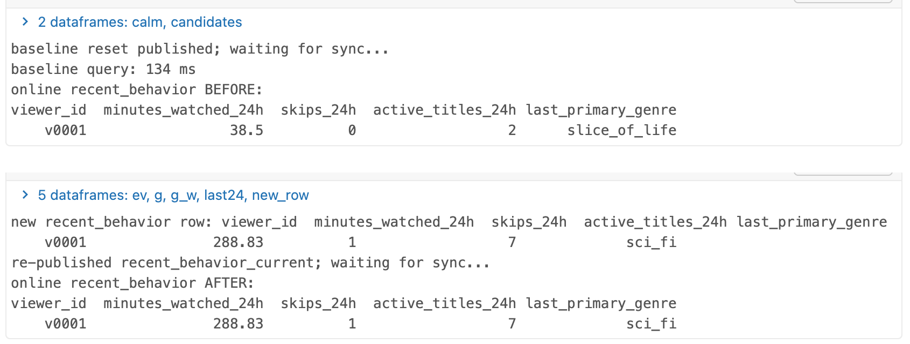
*`images/14-freshness-features.png` — the online row for `v0001` before and after the
three episodes.*

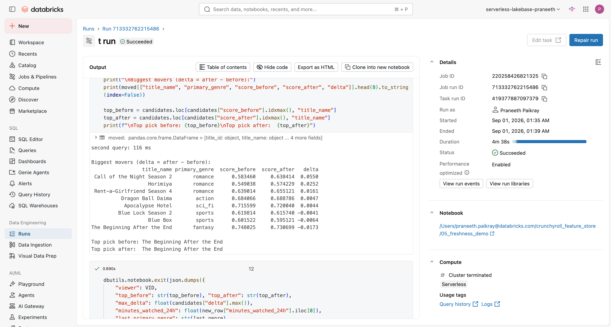
*`images/12-freshness-before-after.png` — the candidates whose score moved, with the
deltas.*

`notebooks/10_streaming_continuous.py` — **CONTINUOUS**: a streaming aggregate maintains
`session_features_current` and the sync pipeline keeps `online_session_features` current
with no refresh call at all. `publish_table(..., publish_mode="CONTINUOUS")` is called
**once**; after that the pipeline owns the freshness.

`features.session_aggregate()` does the aggregation — a 10-minute watermark, per-viewer
`session_seconds`, `session_skips`, `session_events`, `last_event_epoch_s` and the
forwarded `src_event_epoch_ms`. It writes through
`foreachBatch(lambda df, _: fe.write_table(..., mode="merge"))` with a checkpoint on
`/Volumes/<catalog>/<schema>/crfs_ops/checkpoints/`.

Three serverless constraints shaped that design, all of them worth knowing before you
write your own:

- `trigger(processingTime=…)` with no bound is rejected as
  `INFINITE_STREAMING_TRIGGER_NOT_SUPPORTED`; the notebook uses
  `trigger(availableNow=True)` to drain, cycle by cycle.
- `outputMode("append")` on a non-windowed aggregation fails with
  `STREAMING_OUTPUT_MODE.UNSUPPORTED_OPERATION` — it has to be `update`.
- Inside `foreachBatch` you **cannot** construct a credentialed client
  (`cannot configure default credentials`), so the MERGE is done with the `DeltaTable`
  builder against the already-resolved table rather than through a fresh SDK call.

Events arrive via `notebooks/11_event_producer.py`, which has three modes selected by a
widget: `burst` (n events and exit — what the app's button and `make burst` fire), `loop`
(background traffic while you talk, the default for `crfs_streaming`) and `zerobus`
(the same payload over gRPC direct-to-Delta, which needs
`databricks-zerobus-ingest-sdk` declared in the task's `environments:` because it cannot
be pip-installed at runtime on serverless).

**How the freshness number is produced.** Every event carries `produced_epoch_ms`, the
producer's own clock, and that value is aggregated forward into the online row as
`src_event_epoch_ms`. `OnlineStore.wait_for_value()` in `src/crfs/online.py` polls the
keyed row every 250 ms until it sees that value, then subtracts. Both ends of the
subtraction are the same clock, so there is no skew argument — and the poll interval is
reported alongside, because it quantises the answer. The notebook also prints the
platform's own decomposition from the synced-table API (`delta_commit_timestamp` versus
`sync_end_timestamp`), so the compute-and-commit leg and the commit-to-Postgres leg can
be read separately.

**Do not quote the end-to-end number as a platform figure.** On the verified run it was
about 81 seconds, and the decomposition shows why: `availableNow` cycle startup dominates,
and the Lakebase leg itself is roughly 3.8 seconds. That is a property of this
configuration, not of the sync. The number to quote from this beat is the shape — no
refresh call, no orchestration — and the keyed-read latency once the value is there.

> **Screenshots missing:** `images/16-streaming-continuous.png` (the
> `online_session_features` synced table showing `CONTINUOUS` and a moving
> `sync_end_timestamp`) and `images/17-zerobus-events.png` (`engagement_events_stream`
> filling as the producer runs). See [Screenshots](#screenshots).

Zerobus writes to **Delta only** — it cannot write to Lakebase Postgres, and the
published online tables are read-only there because the sync pipeline owns them. Why
this demo does not use Stream Feature Views, Real-Time Mode, or the native Postgres
sink is answered concretely in [docs/streaming_paths.md](docs/streaming_paths.md).

## Step 12 · An agent on the feature store

`notebooks/12_agent_explain.py` logs an `mlflow.pyfunc.ResponsesAgent` (falling back to
`ChatAgent` if the installed MLflow lacks it — the notebook prints which) backed by
`databricks-claude-sonnet-4-5`, with three tools:

| Tool | Calls | Why |
|---|---|---|
| `get_viewer_context(viewer_id, title_id, hour_of_day)` | the **Feature Serving endpoint** `crunchyroll-viewer-features` | The LLM reads the same governed Lakebase values the ranker read, including the request-time UDF outputs. This is the headline of the beat |
| `score_candidates(viewer_id, title_ids, surface, device, hour_of_day)` | the ranker endpoint | Counterfactuals ("would it still rank first on mobile at 8am?") are answered by re-querying, not by guessing |
| `describe_title(title_id)` | `titles` via the SQL warehouse | Readable prose instead of ids |

The system prompt requires it to answer only from tool output, quote the feature values
it used, and say when one is missing. Tool bodies are defined **inline** in the notebook
and templated into a `tools.py` artifact at log time — nothing the served agent needs at
load time may live in `src/crfs/`, which is driver-side only.

Resources are declared at log time (`DatabricksServingEndpoint` ×2, `DatabricksTable`,
`DatabricksSQLWarehouse`) so the endpoint's principal gets automatic auth passthrough;
`auth_mode=secret` with a scoped PAT is the one-widget fallback if a live run needs it.

> **Screenshot missing:** `images/18-agent-trace.png` — the MLflow trace for one answer,
> showing the `get_viewer_context` tool call and the feature values it returned. This one
> needs the notebook to be run first; see
> [what this demo does not do](#what-this-demo-does-not-do).

## The app

A Streamlit app on Databricks Apps — `app/app.py` (the six regions),
`app/lib/lakebase.py` (the Postgres access layer, the same `OnlineStore` class as
`src/crfs/online.py` but vendored so the app has no dependency on the repo's driver
code), `app/app.yaml` (env vars) and `app/requirements.txt`.

| Region in `app/app.py` | What it shows |
|---|---|
| Sidebar — Configuration | Viewer, surface, device, locale, hour, model version, and a **frozen-vs-real clock** toggle. It defaults to frozen, because `session_decay` would otherwise re-score a demo left idle mid-sentence |
| Funnel | `132 → 60 → N entitled → 25`, with a latency chip per hop |
| Ranked Watch Next | Ranked cards, each with a "Why?" expander that calls the explainer agent |
| Online Store (Raw) | The actual rows from the online tables, the SQL that produced them, and a keyed-read latency chip. On-demand values are labelled *computed at request time, not stored* |
| Freshness | A **"watch 3 episodes now"** button that fires the `crfs_event_burst` job, then polls Postgres every 250 ms and reports the measured seconds until the online value moved, then re-ranks and diffs the ordering |
| Operating it | Store capacity, Lakebase endpoint state, per-table sync lag and the last three days of spend, all read live |

If the app's service principal has not been granted read access to the Postgres schema
it degrades to reading the same values through the Feature Serving endpoint and shows a
visible badge. A grant problem never takes the demo down.

Two grant scripts, and both matter:

- `scripts/grant_app_postgres.sh <profile>` — `GRANT USAGE ON SCHEMA`,
  `GRANT SELECT ON ALL TABLES`, then `ALTER DEFAULT PRIVILEGES`. The schema and its
  synced tables are owned by whoever created them, so a fresh app service principal
  connects successfully and still gets `permission denied for schema crunchyroll_demo`.
  The `ALTER DEFAULT PRIVILEGES` line is the part that covers tables published *later* —
  re-run this after any new `publish_table`, which is why `make deploy-app` runs it as a
  post-step.
- `scripts/grant_app_endpoints.sh <profile>` — `CAN_QUERY` on the serving endpoints and
  `CAN_USE` on the warehouse.

The app is deployed by `scripts/deploy_app.sh`, **not** by the bundle: CLI v1.14.1 always
sends `forward_user_access_token` in the update mask and the Apps API rejects it, so
`bundle deploy` cannot update an app that already exists. The reasoning and the filed
issue are in [docs/risks.md](docs/risks.md), and
[docs/app.resource.yml.reference](docs/app.resource.yml.reference) keeps the resource
declaration that *would* go in the bundle once the CLI allows it.

> **Screenshots missing:** `images/19-app-funnel.png`, `images/20-app-lakebase-panel.png`
> and `images/21-app-freshness.png`. The app deploys and its logs are clean, but nobody
> has opened the page. See [Screenshots](#screenshots).

## Step 13 · Operating it

`notebooks/13_ops_and_cost.py` prints one operator table per online table —
`detailed_state`, source commit versus processed commit, lag seconds, pipeline state,
online versus offline row counts — then store capacity, endpoint CU bounds, and 14 days
of DBU and dollars per SKU. Everything it prints comes from `src/crfs/ops.py`:
`sync_summary()`, `sync_lag_seconds()`, `pipeline_health()`, `online_store_status()`,
`lakebase_endpoint()` and `daily_cost()`.

It also persists its own sync numbers to the `crfs_ops_sync_log` table, because
dashboards run SQL and cannot call REST — that table is the only honest way to get sync
state onto a dashboard widget.

The AI/BI dashboard `dashboards/crfs_feature_ops.lvdash.json` has six datasets, every
query tested against the workspace by `scripts/validate_dashboard_queries.sh` before it
was committed:

| Dataset | Source | Answers |
|---|---|---|
| `serving_latency` | `cr_ranker_inference_payload` | p50/p95 and volume by `served_entity_id` — v1 against v2 |
| `request_mix` | `from_json(request)` on the same table | Proves the app sends only keys plus context, never feature values |
| `score_by_genre` | inference payload ⨝ `titles` | Score distribution and the titles that win |
| `sync_health` | `crfs_ops_sync_log` | Per-table sync state and lag. **Empty until notebook 13 has run**, which is correct, not a bug |
| `feature_freshness` | `crfs_ops_sync_log` | How stale the online values are allowed to be |
| `cost` | `system.billing.usage` ⨝ `list_prices` | Daily DBU and list USD per SKU |

If the dashboard looks empty, check the JSON shape first: an earlier version wrapped
everything in a `dashboard {}` object instead of putting `datasets` and `pages` at the top
level, and the API accepted it silently.

> **Screenshots missing:** `images/22-dashboard.png` (the rendered dashboard) and
> `images/23-ops-report.png` (notebook 13's operator table). See
> [Screenshots](#screenshots).

## Cost, and stopping it

**A Lakebase online store cannot scale to zero.** The docs are blunt about it —
*"Lakebase scale-to-zero is not supported"* and *"Online stores continuously incur costs.
Delete online stores that are no longer needed."* It is the one line that bills while
nobody is watching.

Measured, not estimated:

| | |
|---|---|
| SKU | `ENTERPRISE_DATABASE_SERVERLESS_COMPUTE_US_EAST_N_VIRGINIA` at **$0.52/DBU** |
| At `CU_2` | 30.67 DBU/day = **$15.95/day ≈ $485/month** |
| Endpoint at `CU_2` | min 8 / max 16 CU |
| After moving to `CU_1` | endpoint **min 4 / max 8 CU** — the capacity class governs the floor, `CU_N` → 4N CU |

That last row is the useful finding: changing the capacity class moved the endpoint
bounds by itself, with all three published tables staying
`SYNCED_TABLE_ONLINE_NO_PENDING_UPDATE` throughout. So the class is the lever, not the
endpoint's autoscaling bounds — which is why the bundle does not manage
`postgres_endpoints` by default.

```bash
make cost               # daily DBU and list USD, from system.billing
make teardown-cost      # app, endpoints, online tables, online store. Data untouched.
```

Teardown deletes online tables with `w.feature_store.delete_online_table()` — the docs
call it *"the only recommended method"*, because `DROP TABLE` and the synced-table delete
both leave the table behind in Postgres. Getting that wrong produces the confusing state
where Unity Catalog shows nothing and the next `publish_table` still fails with
`AlreadyExists`.

Full details and the five levers in order: [docs/cost_and_sizing.md](docs/cost_and_sizing.md).

## Repo layout — every file

```
setup.sh                                one command, empty workspace to working demo
databricks.yml                          bundle root: ~20 variables, dev/prod targets
Makefile                                every command in this README
.crfs.vars                              GENERATED, gitignored: the per-workspace ids
resources/
  jobs.yml                              crfs_end_to_end (12) + crfs_vertical (5) +
                                        crfs_benchmark, crfs_streaming,
                                        crfs_event_burst, crfs_agent, crfs_teardown
  storage.yml                           the crfs_ops volume (streaming checkpoints)
  lakebase.yml                          opt-in endpoint sizing, off by default
  dashboard.yml                         the AI/BI dashboard resource
notebooks/
  00_data_generation.py                 5 source tables + the empty live-events table
  01_feature_engineering.py             4 feature tables, the online store, 3 publishes
  02_train_ranker.py                    PIT training set, ranker v1
  02b_pit_probe.py                      point-in-time correctness, standalone
  03_deploy_ranker_endpoint.py          serving endpoint + inference tables (run twice)
  04_query_ranker.py                    the application's request; honest latency
  05_freshness_triggered.py             TRIGGERED freshness, with an assertion
  06_ondemand_features.py               4 UC Python UDFs, retrain to v2
  07_feature_serving.py                 feature spec + Feature Serving endpoint
  08_retrieval_ranker.py                SVD retriever, its own published features
  10_streaming_continuous.py            streaming aggregate + CONTINUOUS publish
  11_event_producer.py                  burst | loop | zerobus
  12_agent_explain.py                   explainer agent, 3 tools
  13_ops_and_cost.py                    operator table, capacity, verified cost
  20_rail_data_generation.py            rail catalog, homepage log, measured propensity
  21_rail_features.py                   rail_features + viewer_rail_features_ts, published;
                                        asserts the online copy is one row per key
  22_train_rail_ranker.py               PIT training set, IPS weights, NDCG vs 3 baselines
                                        plus an ablation; logged with its feature spec
  23_deploy_rail_endpoint.py            the request-path endpoint, and what it actually got
  24_homepage_assembly.py               a whole homepage from both rankers; shared-table
                                        overlap resolved from UC; 4-context sensitivity
  25_serving_benchmark.py               fanout, ramp, spike, features-only, server-side
  99_teardown.py                        the UI-runnable mirror of teardown.sh
src/crfs/                               driver-side only -- never imported by a served model
  config.py                             DEFAULTS, Config, the demo clock (end_date_resolved)
  features.py                           the four feature definitions, shared by 01/05/10
  rails.py                              rail catalog, homepage log generator, propensity,
                                        rail + viewer_rail feature builders, eligibility
  udfs.py                               the 4 title UDFs + 3 rail UDFs + FeatureFunctions
  candidates.py                         REQUEST_KEYS, candidates(), query_ranker(), rank()
  loadtest.py                           the benchmark phases: fanout, ramp, spike, reporting
  ops.py                                sync polling, publish_or_refresh, cost, teardown helpers
  online.py                             psycopg access: keyed_read(_composite), latency
app/
  app.py                                the six regions
  lib/lakebase.py                       vendored Postgres access layer
  app.yaml                              env vars passed to the app
  requirements.txt                      streamlit, psycopg, databricks-sdk
dashboards/crfs_feature_ops.lvdash.json six datasets, one page
scripts/
  bootstrap.sh                          discover or create the infrastructure; write .crfs.vars
  preflight.sh                          P0 gate; prints the generated ids
  verify.sh                             is the demo presentable? (used by make verify)
  cost.sh                               daily DBU and USD
  deploy_app.sh                         create/update the app via the Apps API
  grant_app_postgres.sh                 USAGE + SELECT + ALTER DEFAULT PRIVILEGES
  grant_app_endpoints.sh                CAN_QUERY on endpoints, CAN_USE on the warehouse
  lakebase_explore.sh                   psql into the online store
  measure_online_latency.py             keyed-read latency from a laptop
  benchmark_local.py                    the serving benchmark from outside the region
  validate_dashboard_queries.sh         run every dashboard query before committing it
  teardown.sh                           money first, data last; --full to include data
docs/
  vertical_ranking.md                   THE ANSWER DOC: shared store, lifecycle, online
                                        inference, production serving, OOTB vs build
  serving_benchmark.md                  GENERATED by make bench-pull: measured latency
  verification_log.md                   what was run, when, what it returned, and the bugs
  cost_and_sizing.md                    the measured cost and the five levers in order
  streaming_paths.md                    why not Kafka, Feature Views, Real-Time Mode
  risks.md                              known platform sharp edges, including the app/CLI one
  app.resource.yml.reference            the bundle app resource, for when the CLI allows it
architecture/
  feature-store-architecture.drawio     editable source
  feature-store-architecture.drawio.png the image in this README (embeds the XML)
  feature-store-architecture.drawio.svg same, scalable
artifacts/demo_script.md                12 beats with Say-cues
images/                                 screenshots from the live workspace
```

**The one hard rule about `src/crfs/`:** it is driver-side only. Nothing a served model
needs at load time may live there — the ranker, the retriever and the agent's tool bodies
are all defined inline in their notebooks, because a serving endpoint has no access to
the bundle's workspace files. Notebooks import it with a four-line `sys.path` bootstrap
to `${workspace.file_path}` rather than a wheel, so an edit is live on the next
`bundle deploy`.

## Screenshots

Twelve screenshots are in `images/`, all captured from the live workspace this demo was
built on. Twelve more are named below but do not exist yet. They are listed with the
exact filename to use and the exact place to capture it, so anyone can fill them in and
the README's `![...]` links will start resolving without any other edit.

### What exists

| File | Shows | Beat |
|---|---|---|
| `images/01-catalog-explorer.png` | The `crunchyroll_demo` schema in Catalog Explorer | Step 0 |
| `images/02-events-table.png` | `engagement_events` sample rows | Step 0 |
| `images/03-feature-table-viewer.png` | `viewer_features_current` with its PK and feature-table badge | Step 1 |
| `images/04-online-tables.png` | The three published online tables and their sync state | Step 1 |
| `images/13-lakebase-project.png` | The `crunchyroll-online-store` Lakebase project | Step 1 |
| `images/06-pit-proof.png` | The same feature as-of-impression versus as-of-now | Step 2 |
| `images/08b-model-version-spec.png` | The registered model version with its embedded feature spec | Step 2 |
| `images/09-endpoint-ready.png` | The ranker endpoint READY, inference tables on | Step 3 |
| `images/10-query-ranked.png` | 25 candidates in, ranked titles out | Step 4 |
| `images/11-inference-table.png` | `cr_ranker_inference_payload` | Step 4 |
| `images/14-freshness-features.png` | The online row for `v0001` before and after | Step 5 |
| `images/12-freshness-before-after.png` | The candidates whose score moved | Step 5 |

**All twelve were captured on 2026-09-01, before the 2026-09-07/08 corrections.** They
show the right screens and the right shape, but any number visible in them predates the
latency fix and the data-clock fix, so read the numbers from this README's text — those
come from the corrected runs and each has a row in
[docs/verification_log.md](docs/verification_log.md). Re-capturing them is the cheapest
outstanding improvement to this repo.

### What is still missing

Nothing below has been captured. The README marks each gap inline as well, so a reader
never mistakes an absent image for an unwritten step.

| File to create | Capture it from | Prerequisite |
|---|---|---|
| `images/05-ondemand-udfs.png` | Catalog Explorer → the schema → **Functions**, showing the four `cr_*` UDFs. Or the output of `DESCRIBE FUNCTION EXTENDED <catalog>.<schema>.cr_hour_affinity_delta` | `ondemand_features` task has run |
| `images/07-feature-serving-endpoint.png` | **Serving** → `crunchyroll-viewer-features`, showing the served entity is a feature spec, not a model | `feature_serving` task has run |
| `images/15-retriever-recall.png` | Notebook 08's metrics cell: recall@60 for SVD against popularity and random | `train_retriever` task has run |
| `images/16-streaming-continuous.png` | Catalog Explorer → `online_session_features`, showing `CONTINUOUS` and a moving `sync_end_timestamp` | `make streaming` is running |
| `images/17-zerobus-events.png` | `SELECT count(*) FROM engagement_events_stream` climbing while the producer runs | `make streaming` is running |
| `images/18-agent-trace.png` | The MLflow trace for one answer, showing the `get_viewer_context` tool call and the values it returned | **`make agent` has never been run** |
| `images/19-app-funnel.png` | The app's funnel strip with its per-hop latency chips | App page has never been opened |
| `images/20-app-lakebase-panel.png` | The app's raw Lakebase panel: real rows, the SQL, the latency chip | App page has never been opened |
| `images/21-app-freshness.png` | The app after "watch 3 episodes now": the measured seconds and the re-ranked list | App page has never been opened |
| `images/22-dashboard.png` | The rendered `crfs_feature_ops` dashboard | Run notebook 13 first, or `sync_health` is legitimately empty |
| `images/23-ops-report.png` | Notebook 13's operator table | `ops_report` task has run |
| `images/24-cost.png` | `make cost` output, or the `cost` dashboard widget | 24 h at `CU_1` for a clean steady-state figure |

The prerequisite column is the honest reason each one is missing: seven need nothing but
someone taking the screenshot after a run that has already succeeded, three need the app
page opened for the first time, one needs the agent notebook to run at all, and one needs
a full day of billing at `CU_1`.

Convention if you add more: `images/NN-short-name.png`, where `NN` matches the step
number in this README, and add a one-line italic caption under the image saying which
file it is.

## What this demo does not do

Stated plainly so nobody has to guess. The vertical-ranking-specific gaps —
synthetic labels, small online cardinality, no fallback path, no A/B, no streaming
path for rail features — are enumerated with their consequences in
[docs/vertical_ranking.md § 6](docs/vertical_ranking.md). The list below is the rest.

- **No fallback for the request path.** No cached previous ranking, no editorial
  default on timeout, no circuit breaker. A production homepage needs all three, and
  their design affects the latency budget more than the model does.
- **The NDCG lift is a statement about the pipeline, not a forecast.** The labels are
  generated from a latent utility the model can recover. Real gains depend on real
  signal, and the honest measurement is an interleaving or bucket test, which this
  does not have.
- **Position bias is corrected, not eliminated.** IPS with a measured viewport
  propensity assumes the propensity model is right; it is not equivalent to a
  randomised-exposure dataset.
- **4,681 online rows is not 50 million.** Keyed reads on an indexed Postgres table
  degrade gently, but "gently" is not "measured". A scale test on representative
  cardinality is needed before any sizing commitment.
- **No Kafka.** Stream Feature Views (`StreamSource`) require it; the reasoning and the
  alternatives are in [docs/streaming_paths.md](docs/streaming_paths.md).
- **No Feature Views** (the declarative Public Preview API). The feature tables here are
  hand-managed on the GA path.
- **No Real-Time Mode**, and no native `format("postgresql")` streaming sink — the sink
  needs DBR 18.3+ and this workspace tops out at 18.2.
- **No Vector Search.** The retriever's item factors live in the model artifact; the
  README says where that stops scaling.
- **Synthetic data only.** No real Crunchyroll data anywhere.
- **No agent run yet.** `notebooks/12_agent_explain.py` is written against the working
  Feature Serving endpoint but has not been executed. `make agent` is the whole command;
  it is the smallest remaining gap in the story.
- **Twelve screenshots are missing, and the twelve that exist predate the corrections.**
  Named, with capture instructions, in [Screenshots](#screenshots). Nothing in the text
  depends on them.
- **The app page and the dashboard have never been opened.** Both deploy, the app's logs
  are clean and all six dashboard datasets return rows, but no human has looked at either
  rendered surface.

## Going deeper

**Define & materialize** — [Feature tables in UC](https://docs.databricks.com/aws/en/machine-learning/feature-store/uc/feature-tables-uc) · [Feature Views](https://docs.databricks.com/aws/en/machine-learning/feature-store/feature-views) *(Public Preview)*

**Serve online** — [Online Feature Stores](https://docs.databricks.com/aws/en/machine-learning/feature-store/online-feature-store) · [Automatic feature lookup](https://docs.databricks.com/aws/en/machine-learning/feature-store/automatic-feature-lookup) · [Feature & function serving](https://docs.databricks.com/aws/en/machine-learning/feature-store/feature-function-serving) · [On-demand features](https://docs.databricks.com/aws/en/machine-learning/feature-store/on-demand-features)

**Train & deploy** — [Train recommender models](https://docs.databricks.com/aws/en/machine-learning/train-recommender-models) · [Custom endpoints](https://docs.databricks.com/aws/en/machine-learning/model-serving/create-manage-serving-endpoints) · [Production optimization](https://docs.databricks.com/aws/en/machine-learning/model-serving/production-optimization)

**Operate** — [Monitor endpoints](https://docs.databricks.com/aws/en/machine-learning/model-serving/monitor-diagnose-endpoints) · [AI Gateway inference tables](https://docs.databricks.com/aws/en/ai-gateway/inference-tables-serving-endpoints) · [Lakebase](https://docs.databricks.com/aws/en/oltp/)

Natural next threads: two-tower retrieval with Vector Search feeding this ranker;
Feature Views with managed materialisation replacing the hand-managed refresh in
notebook 01; a real Kafka topic for sub-second Stream Feature Views; traffic splitting
between ranker v1 and v2 adjudicated from the inference tables.

## Provenance

Synthetic data; no real Crunchyroll data. Built and verified on a live Databricks
serverless workspace with Lakebase — see
[docs/verification_log.md](docs/verification_log.md) for what was run, when, and what
it returned, including the bugs the process surfaced. Screenshots are from the same workspace but were all captured on 2026-09-01, before the
2026-09-07/08 corrections — see [Screenshots](#screenshots) for what that means and for
the twelve that have not been captured at all.
