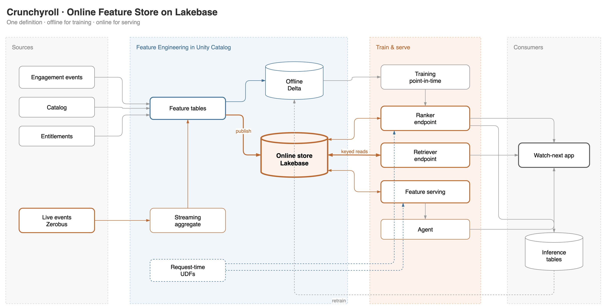
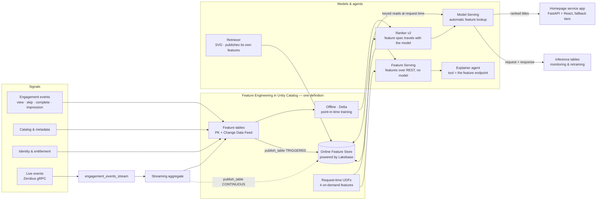

# Crunchyroll · Shared feature store, two ranking models, one request path


60–75 minutes · customer-facing · Databricks Feature Engineering in Unity Catalog +
Lakebase Online Feature Store + Model Serving + Databricks Apps

**Vertical ranking decides which rails go on the homepage. Horizontal ranking decides
which titles go inside them. They share one feature layer.**

One set of feature definitions produces point-in-time-correct training data offline
and low-latency keyed reads online from Lakebase. Adding a whole second ranking
model, at a different grain, with a different label, cost **two feature tables and
three request-time UDFs** — nothing was forked and neither model owns a private copy
of a viewer feature. The rail ranker is configured for a request path (no
scale-to-zero, explicit provisioned concurrency, route optimization) and its
latency, throughput, autoscaling and spike behaviour are **measured**, not asserted.

```bash
./setup.sh --profile <PROFILE>     # empty workspace to working demo, one command
```

Everything claimed here was run on a live workspace. Measurements come with the
command that produced them, and anything not yet verified is listed as not yet
verified — see [docs/verification_log.md](docs/verification_log.md).

**Reading for the Crunchyroll DSML ask specifically:**
[docs/ask_alignment.md](docs/ask_alignment.md) — **start here.** A line-by-line audit of
the ask against what was built, with every row marked met / partial / not met and named
to its evidence.
[docs/vertical_ranking.md](docs/vertical_ranking.md) — shared feature store, model
lifecycle, online inference, production serving, and an explicit list of what
Databricks provides versus what Crunchyroll would build and operate.
[docs/serving_benchmark.md](docs/serving_benchmark.md) — the measured serving
numbers, written by the benchmark job rather than by hand.
[docs/batch_and_online.md](docs/batch_and_online.md) — **the batch path and what carries
over to online.** Read this if the near-term deliverable is batch: same features, same
model, `score_batch` offline, and the measured proof that batch and online produce the
identical collection order.
[docs/open_items.md](docs/open_items.md) — what is unfinished or undecided, and the one
question only Crunchyroll can answer (whether rendered rail position is in their log).

## Where to read what

| You want | Read |
|---|---|
| to run it | [QUICKSTART.md](QUICKSTART.md) — prerequisites, one command, step by step, teardown |
| what was asked versus what exists | [docs/ask_alignment.md](docs/ask_alignment.md) — every row met / partial / not met, named to its evidence |
| the architecture and the measured numbers | [docs/vertical_ranking.md](docs/vertical_ranking.md) — the answer document |
| the guided tour of every step | [docs/walkthrough.md](docs/walkthrough.md) |
| the batch-first path | [docs/batch_and_online.md](docs/batch_and_online.md) — same features, same model, `score_batch` |
| serving latency and throughput | [docs/serving_benchmark.md](docs/serving_benchmark.md) — written by the job, not by hand |
| **the whole flow on one page** | [architecture/end-to-end-flow.drawio](architecture/end-to-end-flow.drawio) ([PNG](architecture/end-to-end-flow.drawio.png)) — sources → features → stores → train/promote → serving → homepage service |
| the app: both rankers in one request, and the fallback | [docs/homepage_service.md](docs/homepage_service.md) — ~100 ms p50 in region, budget + circuit breaker + cached/editorial tiers |
| rolling out a new model version | [docs/canary.md](docs/canary.md) — the canary gate: split, judge, promote or roll back |
| declarative feature authoring | [docs/feature_views.md](docs/feature_views.md) *(Public Preview)* |
| changing a feature definition safely | [docs/feature_versioning.md](docs/feature_versioning.md) |
| GPU training | [docs/gpu_training.md](docs/gpu_training.md) *(Public Preview)* |
| what is unfinished | [docs/open_items.md](docs/open_items.md) · [docs/risks.md](docs/risks.md) |
| everything else | [docs/README.md](docs/README.md) is the full index |

---

## The problem

Every Crunchyroll surface asks the same question: given this viewer, this session and
this catalog, what should we show next? Genre affinity builds over months. A skip
matters within seconds. One pipeline cannot serve both, so teams build the feature
joins twice — once for training, once for serving — and every divergence between the
two is silent damage to the model in production.

The fix is to **define a feature once and use it everywhere**: the same governed
definitions feed historically correct training data (offline, Delta in Unity Catalog)
and low-latency keyed reads (online, Lakebase), and the serving endpoint retrieves
features itself because the feature spec travels inside the registered model.

## Architecture



Editable source: [`architecture/feature-store-architecture.drawio`](architecture/feature-store-architecture.drawio)
(the PNG and SVG both embed the diagram XML, so either opens in draw.io).

<details>
<summary>Same diagram as Mermaid, with the streaming and agent paths spelled out</summary>



</details>

Freshness is chosen **per feature class**, never globally:

| Feature class | Table | Examples | Offline | Online |
|---|---|---|---|---|
| Long-horizon viewer | `viewer_features_ts` → `viewer_features_current` | genre affinity (8), completion propensity, habitual watch hour | PIT training | latest keyed values |
| Recent behaviour | `recent_behavior_current` | minutes 24h, skips 24h, last genre, last-event epoch | periodic recompute | TRIGGERED refresh |
| Live session | `session_features_current` | session seconds, skips, event count | streaming aggregate | **CONTINUOUS** sync |
| Title & catalog | `title_features` | popularity 30d, rating, recency, genre flags | training + retrieval | candidate context |
| Retrieval embedding | `viewer_embedding_current` | 8 SVD viewer factors | training | keyed lookup by the retriever |
| **Request-time** | none — 4 UC Python UDFs | affinity×genre, affinity×popularity, hour affinity, session decay | computed in the training set | **computed inside the endpoint** |
| Policy & entitlement | `entitlements` | territory, tier, maturity | — | hard filter before scoring |

## Deploy it

```bash
./setup.sh --profile <PROFILE>     # empty workspace to working demo, one command
```

Or step by step:

```bash
make preflight  PROFILE=<PROFILE>   # prerequisites, and the ids this workspace generates
make deploy     PROFILE=<PROFILE>   # jobs, volume, dashboard AND the app -- one bundle deploy
make demo       PROFILE=<PROFILE>   # horizontal: shared features + watch-next ranker (~35 min)
make vertical   PROFILE=<PROFILE>   # vertical: rails, rail features, rail ranker (~15 min)
make deploy-app PROFILE=<PROFILE>   # build the React frontend, push the app, then its grants
make canary     PROFILE=<PROFILE>   # judge a challenger behind the live endpoint (dry run)
make bench      PROFILE=<PROFILE>   # load-test the rail endpoint, in region
make verify     PROFILE=<PROFILE>   # assert the demo is presentable
make cost       PROFILE=<PROFILE>   # what it is billing right now
make teardown-cost PROFILE=<PROFILE># stop the money, keep the data
```

`make help` lists every target. Prerequisites, the full target table, every variable,
and what to do when something fails are in **[QUICKSTART.md](QUICKSTART.md)**.

Nothing is pinned to the workspace this was built on. `scripts/bootstrap.sh` resolves
the three ids that differ per workspace — SQL warehouse, Lakebase database resource,
billing endpoint uid — into `.crfs.vars`, which is gitignored and passed to the bundle
as `--var` flags.

Two things the bundle deliberately does not own, with the reasons in
[`databricks.yml`](databricks.yml): the **online store**, because
`fe.create_online_store` must own the Lakebase project for serving metadata to resolve,
and the **published online tables**, because a raw synced table is not registered as a
feature-store online table and automatic lookup would not resolve it.

---

## What runs, in order

`crfs_end_to_end` is one job whose run page is the demo artifact.

```
00 generate_data → 01 build_features → ┬─ 02b pit_probe
                                       ├─ 02 train_ranker → 03 deploy_ranker → 04 smoke_query
                                       │        → 06 ondemand_features → ┬ 03 deploy_ranker_v2 → 05 freshness_triggered
                                       │                                 └ 07 feature_serving
                                       └─ 08 train_retriever
                                                     all → 13 ops_report
```

Then `crfs_vertical` builds rail ranking on the feature layer this job created — see
[Vertical ranking](#vertical-ranking--the-rails-themselves) for its DAG.

Satellites: `crfs_benchmark` (load-test the rail endpoint, repeatable after any config
change), `crfs_streaming` (producer ‖ streaming aggregate + CONTINUOUS publish),
`crfs_event_burst` (the app's button), `crfs_agent`, `crfs_teardown`.

| # | Notebook | Job task key | What it establishes |
|---|---|---|---|
| 00 | `notebooks/00_shared/00_data_generation.py` | `generate_data` | Synthetic catalog, viewers, entitlements, 90 days of engagement, plus an empty live-events table |
| 01 | `notebooks/00_shared/01_feature_engineering.py` | `build_features` | Four feature tables, the Lakebase online store, three published online tables |
| 02b | `notebooks/10_horizontal/02b_pit_probe.py` | `pit_probe` | Point-in-time correctness, standalone |
| 02 | `notebooks/10_horizontal/02_train_ranker.py` | `train_ranker` | PIT training set, ranker v1, feature spec inside the model |
| 03 | `notebooks/10_horizontal/03_deploy_ranker_endpoint.py` | `deploy_ranker`, then `deploy_ranker_v2` | Serving endpoint + AI Gateway inference table. The same notebook runs twice with a different `model_version` |
| 04 | `notebooks/10_horizontal/04_query_ranker.py` | `smoke_query` | Keys and context in, ranked titles out; honest latency numbers |
| 06 | `notebooks/10_horizontal/06_ondemand_features.py` | `ondemand_features` | Four UC Python UDFs, retrain to ranker v2 |
| 07 | `notebooks/10_horizontal/07_feature_serving.py` | `feature_serving` | Feature spec + Feature Serving endpoint, no model in the path |
| 08 | `notebooks/10_horizontal/08_retrieval_ranker.py` | `train_retriever` | SVD retriever, its own published feature table, the funnel |
| 05 | `notebooks/10_horizontal/05_freshness_triggered.py` | `freshness_triggered` | TRIGGERED freshness: event → feature → online → different ranking |
| 13 | `notebooks/90_ops/13_ops_and_cost.py` | `ops_report` | Sync health, capacity, verified cost |
| 10 | `notebooks/40_streaming/10_streaming_continuous.py` | `streaming_aggregate` (job `crfs_streaming`) | CONTINUOUS freshness with a measured event→online latency |
| 11 | `notebooks/40_streaming/11_event_producer.py` | `produce_events` (`crfs_streaming`), `burst` (`crfs_event_burst`) | Event producer: burst, loop, or Zerobus gRPC |
| 12 | `notebooks/50_agent/12_agent_explain.py` | `agent` (job `crfs_agent`) | Agent whose tool is the Feature Serving endpoint |
| 20 | `notebooks/20_vertical/20_rail_data_generation.py` | `rail_data` (job `crfs_vertical`) | Rail catalog, rail × title map, the homepage impression log with position bias, and the measured propensity table |
| 21 | `notebooks/20_vertical/21_rail_features.py` | `rail_features` (`crfs_vertical`) | `rail_features` + `viewer_rail_features_ts`, both published to the same online store; asserts the online copy is one row per key |
| 22 | `notebooks/20_vertical/22_train_rail_ranker.py` | `train_rail_ranker` (`crfs_vertical`) | Point-in-time training set, IPS-weighted fit, NDCG against three baselines plus an ablation, logged with its feature spec and registered |
| 23 | `notebooks/20_vertical/23_deploy_rail_endpoint.py` | `deploy_rail_endpoint` (`crfs_vertical`) | The request-path endpoint — no scale-to-zero, provisioned concurrency, route optimization — and a record of what it actually got |
| 24 | `notebooks/20_vertical/24_homepage_assembly.py` | `homepage_assembly` (`crfs_vertical`) | A whole homepage from both rankers; shared-table overlap resolved from UC; four-context sensitivity check |
| 25 | `notebooks/90_ops/25_serving_benchmark.py` | `benchmark` (job `crfs_benchmark`) | fanout, concurrency ramp, traffic spike, feature-serving comparison, server-side attribution |
| 99 | `notebooks/90_ops/99_teardown.py` | `teardown` (job `crfs_teardown`) | Stop the money, from the UI |
| 29 | `notebooks/30_advanced/29_preview_probe.py` | `feature_views_probe` (job `crfs_preview_probe`) | Is the Feature Views preview usable on this workspace? Registers nothing |
| 29b | `notebooks/30_advanced/29b_gpu_probe.py` | `gpu_probe` (`crfs_preview_probe`) | What accelerator does a GPU task actually get? |
| 30 | `notebooks/30_advanced/30_feature_views.py` | `feature_views` (job `crfs_feature_views`) | Declarative authoring: declare, register, train from, score, materialize |
| 31 | `notebooks/30_advanced/31_feature_versioning.py` | `versioning` (job `crfs_versioning`) | What a deployed version pins; the in-place-function experiment; a canary |
| 32 | `notebooks/30_advanced/32_gpu_train.py` | `gpu_train` (job `crfs_gpu_train`) | Torch on a serverless A10, same training set, same feature spec |

Task keys matter in practice: a failure on the run page names the task, and
`databricks bundle run crfs_end_to_end --only <task_key>` re-runs just that one.
Note that `deploy_ranker` and `deploy_ranker_v2` are the *same notebook file* — the only
difference is the `model_version` parameter, which is why the notebook takes it as a
widget instead of resolving "latest" itself.

---

## Vertical ranking — the rails themselves

The homepage is a stack of rails: Continue Watching, This Season's Simulcasts, Top 10
in Your Country, Action & Adventure. **Vertical ranking orders those rails.**
Horizontal ranking orders the titles inside each one. Same viewer, same request, same
feature store — two models with different grains and different labels.

```
00 generate_data ──► 20 rail_data ──► 21 rail_features ──► 22 train_rail_ranker
                                                                    │
                                                       23 deploy_rail_endpoint
                                                                    │
                                                        24 homepage_assembly
                                                     (needs both endpoints)

                     25 serving_benchmark   ── its own job: real load on a live
                                               endpoint, repeatable after any
                                               config change
```

### What it added to the feature layer

| Table | PK | Offline | Online | Shared |
|---|---|---|---|---|
| `viewer_features_current` | viewer_id | latest | ✅ | **reused unchanged** |
| `recent_behavior_current` | viewer_id | triggered | ✅ | **reused unchanged** |
| `title_features` | title_id | daily | ✅ | **reused** (rail content stats) |
| `rail_features` | rail_id | daily | ✅ | new — 16 rows |
| `viewer_rail_features_ts` | viewer_id + rail_id (+ ts) | 463,419 daily snapshots | ✅ **4,681 rows, one per key** | new |

Plus three new request-time UDFs (`cr_rail_taste_match`, `cr_rail_click_recency`,
`cr_device_rail_fit`) and **two reused verbatim** from the watch-next ranker
(`cr_hour_affinity_delta`, `cr_session_decay`).

### One table for offline and online

`viewer_rail_features_ts` is a **time series feature table**, published straight to
the online store. Offline it holds every daily snapshot and the training join is
point-in-time. Publishing it **deduplicates to the latest row per
`(viewer_id, rail_id)`** — measured on this workspace:

```
offline: 463,419 rows across 4,681 (viewer, rail) keys
The measurements, the position-bias correction, the ablation and the reuse
analysis are in [docs/vertical_ranking.md](docs/vertical_ranking.md); the
step-by-step detail is in [docs/walkthrough.md](docs/walkthrough.md).

### The request contract

Seven fields per candidate rail. **45** feature values are resolved inside the
endpoint.

```json
{"dataframe_records": [
  {"viewer_id": "v0042", "rail_id": "r_continue", "device": "tv", "locale": "en-US",
   "hour_of_day": 21, "day_of_week": 5, "request_epoch_s": 1789000000},
  {"viewer_id": "v0042", "rail_id": "r_simulcast", "...": "..."}
]}
```

The response comes back **already ranked** — the model sorts within the request,
grouped by `viewer_id` so a batched multi-viewer call cannot mix one viewer's order
into another's:

```json
{"predictions": [
  {"rail_id": "r_continue",  "engagement_probability": 0.4131, "rail_rank": 1},
  {"rail_id": "r_simulcast", "engagement_probability": 0.2884, "rail_rank": 2}
]}
```

Eligibility runs **before** scoring and is a hard filter, not a feature: a viewer
with nothing in progress is not offered Continue Watching and no score can overrule
that. Same discipline as the entitlement join on the horizontal side.

### Configured for a request path

This is the difference between the two endpoints, and it matters more than any model
change:

| Setting | `crunchyroll-rail-ranker` | `crunchyroll-watch-next-ranker` |
|---|---|---|
| `scale_to_zero_enabled` | **false** | true |
| provisioned concurrency | **4 – 32** | — (`workload_size: Small`) |
| `route_optimized` | **true** (create-time only) | false |
| inference table | `cr_rail_inference` | `cr_ranker_inference` |

`workload_size` and the provisioned-concurrency pair are mutually exclusive in the
API. Notebook 23 asks for the explicit pair, falls back to `workload_size` if the
workspace rejects it, and **records which one it actually got** — a latency table is
unfalsifiable without it. `verify.sh` fails if `scale_to_zero` is not disabled.

### Measured under load

`make bench` runs five phases as a job inside the region, and writes both a UC table
(`crfs_serving_benchmark`, one row per phase with the endpoint config beside it) and
a markdown write-up. `make bench-local` runs the identical code from a laptop.

| Phase | Question |
|---|---|
| `fanout` | Marginal latency per additional candidate rail — each one is another pair of online lookups inside the same call |
| `ramp` | Percentiles and achieved req/s at concurrency 1→64, with error codes counted rather than swallowed |
| `spike` | Step from 2 to 48 concurrent with no ramp: first-second p95, seconds to recover, anything rejected |
| `features_only` | The same fanout against Feature Serving — the online-lookup share, measured |
| `server_side` | `execution_time_ms` from the inference table, which excludes the network |

Numbers live in [docs/serving_benchmark.md](docs/serving_benchmark.md). They are not
repeated here on purpose: a latency number copied by hand into a README is a latency
number that will be wrong by next week.

---

## The advanced track

Three additions that answer questions asked after the first readout. All of it is
additive: the GA pipeline above does not depend on any of it, and both previews it uses
are enabled per workspace.

**Run `make probe` first.** It reports whether this workspace has the two previews,
registers nothing and writes nothing.

| | Command | What it shows | Doc |
|---|---|---|---|
| **Feature Views** | `make feature-views` | The same viewer aggregates *declared* instead of computed: 7 features over `engagement_events`, registered in UC, a training set with **no table name in it**, logged into a model, scored in batch, then materialized into the online store the GA demo already owns | [feature_views.md](docs/feature_views.md) |
| **Versioning** | `make versioning` | What a deployed model version **pins**, measured against the live endpoint rather than assumed — including redefining a UC function underneath it and finding the answers unchanged — plus a 90/10 canary traffic split and a reverse index of which models pin which objects | [feature_versioning.md](docs/feature_versioning.md) |
| **GPU training** | `make gpu-train` | The rail ranker as a torch MLP on a serverless A10, from the **same** point-in-time training set, logged with the **same** feature spec so it is a drop-in for the same endpoint. Closes [open_items](docs/open_items.md) §4 | [gpu_training.md](docs/gpu_training.md) |

Measured by `make probe` on this workspace (us-east-1): Feature Views usable, and a task
asking for `GPU_1xA10` gets an **NVIDIA A10G, 23 GB, torch 2.7.1+cu126**. Neither preview
is available in GCP us-west1, which is Crunchyroll's region — the same gap as Lakebase.

The finding worth carrying into any design discussion, and it is the opposite of what this
repo first assumed: **a deployed model appears pinned to its on-demand functions too.**
Redefining `cr_rail_taste_match` under the live endpoint changed nothing — 0 of 16 rails
moved, score delta 0.000000, polled over five minutes. So a UC function is resolved at
deploy time or cached well beyond a request, not looked up live. Version definitions by name
anyway: the pinning is an observation rather than a promise, and an in-place edit is
invisible to every audit trail a model version has.

---

## Repo layout — every file

```
QUICKSTART.md                           prerequisites, one command, step by step, teardown
setup.sh                                one command, empty workspace to working demo
databricks.yml                          bundle root: ~20 variables, dev/prod targets
Makefile                                every command in this README
.crfs.vars                              GENERATED, gitignored: the per-workspace ids
resources/
  jobs.yml                              crfs_end_to_end (12) + crfs_vertical (5) +
                                        crfs_benchmark, crfs_batch, crfs_streaming,
                                        crfs_event_burst, crfs_agent, crfs_teardown
  jobs_advanced.yml                     crfs_preview_probe, crfs_feature_views,
                                        crfs_versioning, crfs_canary, crfs_gpu_train
  app.yml                               the app: command, env, budgets and its five resources
  storage.yml                           the crfs_ops volume (streaming checkpoints)
  lakebase.yml                          opt-in endpoint sizing, off by default
  dashboard.yml                         the AI/BI dashboard resource
notebooks/                              grouped by track; the number prefixes are the order
  00_shared/
    00_data_generation.py               5 source tables + the empty live-events table
    01_feature_engineering.py           4 feature tables, the online store, 3 publishes
  10_horizontal/                        titles inside a rail
    02_train_ranker.py                  PIT training set, ranker v1
    02b_pit_probe.py                    point-in-time correctness, standalone
    03_deploy_ranker_endpoint.py        serving endpoint + inference tables (run twice)
    04_query_ranker.py                  the application's request; honest latency
    05_freshness_triggered.py           TRIGGERED freshness, with an assertion
    06_ondemand_features.py             4 UC Python UDFs, retrain to v2
    07_feature_serving.py               feature spec + Feature Serving endpoint
    08_retrieval_ranker.py              SVD retriever, its own published features
  20_vertical/                          the rails themselves
    20_rail_data_generation.py          rail catalog, homepage log, measured propensity
    21_rail_features.py                 rail_features + viewer_rail_features_ts, published;
                                        asserts the online copy is one row per key
    22_train_rail_ranker.py             PIT training set, IPS weights, NDCG vs 3 baselines
                                        plus an ablation; logged with its feature spec
    23_deploy_rail_endpoint.py          the request-path endpoint, and what it actually got
    24_homepage_assembly.py             a whole homepage from both rankers; shared-table
                                        overlap resolved from UC; 4-context sensitivity
    26_batch_scoring.py                 score_batch offline; batch and online agree
  30_advanced/                          Public Preview APIs; nothing above depends on these
    29_preview_probe.py                 is Feature Views usable here? writes nothing
    29b_gpu_probe.py                    what accelerator does a GPU task actually get?
    30_feature_views.py                 declare features, train from them, materialize
    31_feature_versioning.py            what a deployed model pins; the UDF experiment; a canary
    32_gpu_train.py                     torch on a serverless A10, same feature spec
    33_canary_gate.py                   challenger at 10%, paired per-entity checks, gate
  40_streaming/
    10_streaming_continuous.py          streaming aggregate + CONTINUOUS publish
    11_event_producer.py                burst | loop | zerobus
  50_agent/
    12_agent_explain.py                 explainer agent, 3 tools
  90_ops/
    13_ops_and_cost.py                  operator table, capacity, verified cost
    25_serving_benchmark.py             fanout, ramp, spike, features-only, server-side
    99_teardown.py                      the UI-runnable mirror of teardown.sh
src/crfs/                               driver-side only -- never imported by a served model
  config.py                             DEFAULTS, Config, the demo clock (end_date_resolved)
  features.py                           the four feature definitions, shared by 01/05/10
  feature_views.py                      the same shape of signal, declared (preview path)
  rails.py                              rail catalog, homepage log generator, propensity,
                                        rail + viewer_rail feature builders, eligibility
  udfs.py                               the 4 title UDFs + 3 rail UDFs + FeatureFunctions
  versioning.py                         read a model's pinned feature spec; fingerprint; drift
  canary.py                             split/restore config, per-entity scoring, the gate
  train_gpu.py                          export to a volume, then torch minibatch training
  candidates.py                         REQUEST_KEYS, candidates(), query_ranker(), rank()
  loadtest.py                           the benchmark phases: fanout, ramp, spike, reporting
  ops.py                                sync polling, publish_or_refresh, cost, teardown helpers
  online.py                             psycopg access: keyed_read(_composite), latency
ai/                                     the AI Runtime CLI path (`air`)
  train.yaml                            accelerator, dependencies, code snapshot, timeout
  train_entrypoint.py                   headless entry point; calls src/crfs/train_gpu.py
app/                                    the homepage service -- docs/homepage_service.md
  backend/main.py                       FastAPI routes, SSE (explain, burst), static files
  backend/homepage.py                   one request: both rankers + online rows, fanned out
  backend/fallback.py                   timeout budget, circuit breaker, fallback tiers
  backend/snapshot.py                   reference data in memory: no warehouse per request
  backend/clients.py                    HTTP/2 serving client, async Postgres pool, warehouse
  frontend/                             React + TypeScript + Tailwind (Vite); `make frontend`
  requirements.txt                      fastapi, uvicorn, httpx, psycopg[pool], databricks-sdk
dashboards/crfs_feature_ops.lvdash.json six datasets, one page
scripts/
  bootstrap.sh                          discover or create the infrastructure; write .crfs.vars
  preflight.sh                          P0 gate; prints the generated ids
  verify.sh                             is the demo presentable? (used by make verify)
  cost.sh                               daily DBU and USD
  grant_app_postgres.sh                 USAGE + SELECT + ALTER DEFAULT PRIVILEGES
  grant_app_endpoints.sh                CAN_QUERY on endpoints, CAN_USE on the warehouse
  grant_app_uc.sh                       USE_CATALOG / USE_SCHEMA / SELECT for the app SP
  lakebase_explore.sh                   psql into the online store
  measure_online_latency.py             keyed-read latency from a laptop
  bench_app.py                          the deployed homepage service, per stage, in region
  benchmark_local.py                    the serving benchmark from outside the region
  validate_dashboard_queries.sh         run every dashboard query before committing it
  teardown.sh                           money first, data last; --full to include data
docs/                                   docs/README.md is the index
  ask_alignment.md                      the ask, audited row by row
  vertical_ranking.md                   THE ANSWER DOC: shared store, lifecycle, online
                                        inference, production serving, OOTB vs build
  walkthrough.md                        the guided tour of every step, plus the screenshots
  batch_and_online.md                   the batch path, and what carries over to online
  feature_views.md                      declarative authoring, and what it can express
  feature_versioning.md                 changing a definition without breaking serving
  gpu_training.md                       three ways to a GPU; how data reaches it
  serving_benchmark.md                  GENERATED by make bench-pull: measured latency
  verification_log.md                   what was run, when, what it returned, and the bugs
  cost_and_sizing.md                    the measured cost and the five levers in order
  streaming_paths.md                    why not Kafka, Stream Feature Views, Real-Time Mode
  risks.md                              known platform sharp edges, with symptoms and fixes
  open_items.md                          what is unfinished, and the one question only
                                        Crunchyroll can answer
  demo_script.md                        the readout script, pinned to measured numbers
  deck/index.html                       the deck the readout was delivered from
  architecture.drawio                   editable architecture source
architecture/
  feature-store-architecture.drawio     editable source
  feature-store-architecture.drawio.png the image in this README (embeds the XML)
  feature-store-architecture.drawio.svg same, scalable
images/                                 screenshots from the live workspace
```

**The one hard rule about `src/crfs/`:** it is driver-side only. Nothing a served model
needs at load time may live there — the ranker, the retriever and the agent's tool bodies
are all defined inline in their notebooks, because a serving endpoint has no access to
the bundle's workspace files. Notebooks import it with a four-line `sys.path` bootstrap
to `${workspace.file_path}` rather than a wheel, so an edit is live on the next
`bundle deploy`.

## What this demo does not do

Stated plainly so nobody has to guess. The vertical-ranking-specific gaps —
synthetic labels, small online cardinality, no fallback path, no A/B, no streaming
path for rail features — are enumerated with their consequences in
[docs/vertical_ranking.md § 6](docs/vertical_ranking.md). The list below is the rest.

- **No fallback for the request path.** No cached previous ranking, no editorial
  default on timeout, no circuit breaker. A production homepage needs all three, and
  their design affects the latency budget more than the model does.
- **The NDCG lift is a statement about the pipeline, not a forecast.** The labels are
  generated from a latent utility the model can recover. Real gains depend on real
  signal, and the honest measurement is an interleaving or bucket test, which this
  does not have.
- **Position bias is corrected, not eliminated.** IPS with a measured viewport
  propensity assumes the propensity model is right; it is not equivalent to a
  randomised-exposure dataset.
- **4,681 online rows is not 50 million.** Keyed reads on an indexed Postgres table
  degrade gently, but "gently" is not "measured". A scale test on representative
  cardinality is needed before any sizing commitment.
- **No Kafka.** Stream Feature Views (`StreamSource`) require it; the reasoning and the
  alternatives are in [docs/streaming_paths.md](docs/streaming_paths.md).
- **Two tracks stand on Public Preview APIs.** Feature Views and AI Runtime serverless
  GPU are both preview, enabled per workspace, and **neither is available in GCP
  us-west1** — Crunchyroll's own region, the same gap as Lakebase. `make probe` reports
  what a given workspace actually has. The GA pipeline does not depend on either.
- **The GA feature tables stay hand-managed.** `make feature-views` shows the
  declarative path beside them; it does not replace them, and
  [docs/feature_views.md](docs/feature_views.md) says feature by feature what would and
  would not survive a migration.
- **No Real-Time Mode**, and no native `format("postgresql")` streaming sink — the sink
  needs DBR 18.3+ and this workspace tops out at 18.2.
- **No Vector Search.** The retriever's item factors live in the model artifact; the
  README says where that stops scaling.
- **Synthetic data only.** No real Crunchyroll data anywhere.
- **The explainer agent is a placeholder.** `notebooks/50_agent/12_agent_explain.py`'s
  pyfunc `predict()` returns a fixed string, and no agent endpoint is deployed. The app's
  "Why this?" therefore calls a foundation model directly, grounded on the online rows the
  service read (`docs/homepage_service.md`). Making notebook 12 a real tool-calling agent is
  still open.
- **Twelve screenshots are missing, and the twelve that exist predate the corrections.**
  Named, with capture instructions, in [docs/walkthrough.md](docs/walkthrough.md#screenshots--what-exists-and-what-is-missing). Nothing in the text
  depends on them.
- **The dashboard has never been opened.** All six datasets return rows, but no human
  has looked at the rendered surface. The app has — `images/15-homepage-service.png` is
  the deployed page, captured 2026-09-23.

## Going deeper

**Define & materialize** — [Feature tables in UC](https://docs.databricks.com/aws/en/machine-learning/feature-store/uc/feature-tables-uc) · [Feature Views](https://docs.databricks.com/aws/en/machine-learning/feature-store/feature-views) *(Public Preview)*

**Serve online** — [Online Feature Stores](https://docs.databricks.com/aws/en/machine-learning/feature-store/online-feature-store) · [Automatic feature lookup](https://docs.databricks.com/aws/en/machine-learning/feature-store/automatic-feature-lookup) · [Feature & function serving](https://docs.databricks.com/aws/en/machine-learning/feature-store/feature-function-serving) · [On-demand features](https://docs.databricks.com/aws/en/machine-learning/feature-store/on-demand-features)

**Train & deploy** — [Train recommender models](https://docs.databricks.com/aws/en/machine-learning/train-recommender-models) · [Custom endpoints](https://docs.databricks.com/aws/en/machine-learning/model-serving/create-manage-serving-endpoints) · [Production optimization](https://docs.databricks.com/aws/en/machine-learning/model-serving/production-optimization)

**Operate** — [Monitor endpoints](https://docs.databricks.com/aws/en/machine-learning/model-serving/monitor-diagnose-endpoints) · [AI Gateway inference tables](https://docs.databricks.com/aws/en/ai-gateway/inference-tables-serving-endpoints) · [Lakebase](https://docs.databricks.com/aws/en/oltp/)

**Preview tracks** — [Feature Views](https://docs.databricks.com/aws/en/machine-learning/feature-store/feature-views) · [AI Runtime, serverless GPU](https://docs.databricks.com/aws/en/machine-learning/ai-runtime/) · [AI Runtime CLI](https://docs.databricks.com/aws/en/machine-learning/ai-runtime/cli/) · [Introducing Feature Views](https://www.databricks.com/blog/introducing-feature-views)

Natural next threads: two-tower retrieval with Vector Search feeding this ranker;
migrating the viewer-grain aggregates to Feature Views once the preview reaches
Crunchyroll's region; a real Kafka topic for sub-second Stream Feature Views; and an
online-quality metric (clicks by served entity from the inference table) added to the
canary gate in notebook 33, which today judges errors, latency and ranking agreement.

## Provenance

Synthetic data; no real Crunchyroll data. Built and verified on a live Databricks
serverless workspace with Lakebase — see
[docs/verification_log.md](docs/verification_log.md) for what was run, when, and what
it returned, including the bugs the process surfaced. Screenshots are from the same workspace but were all captured on 2026-09-01, before the
2026-09-07/08 corrections — see [docs/walkthrough.md](docs/walkthrough.md#screenshots--what-exists-and-what-is-missing) for what that means and for
the twelve that have not been captured at all.
