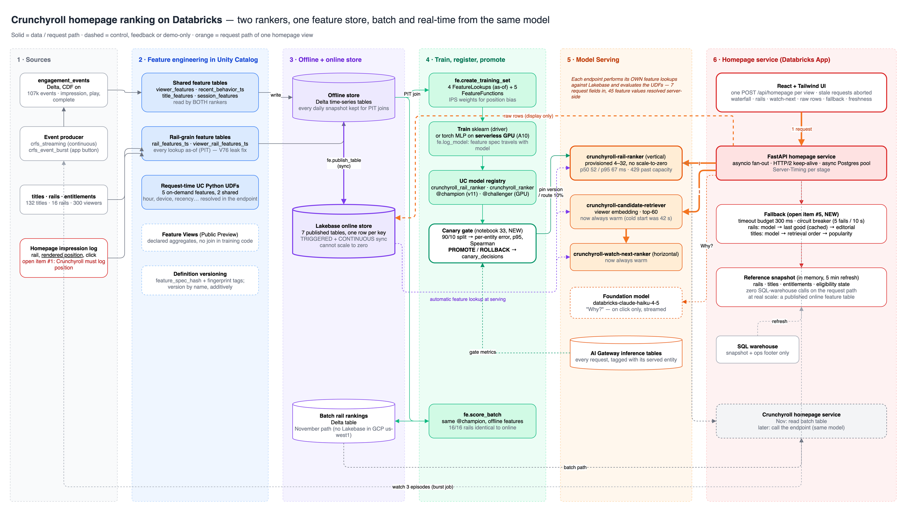

# The homepage service: both rankers in one request, and what happens when they do not answer



*Source: [`architecture/end-to-end-flow.drawio`](../architecture/end-to-end-flow.drawio) — open it in
draw.io to edit. Orange is the request path of one homepage view.*

The Databricks App (`crfs-watch-next`) is a reference **homepage service**: a FastAPI
backend that fans out to both rankers and the Lakebase online store in one request,
and a React + Tailwind frontend that shows what came back and how long each piece took.
It replaced a Streamlit page on 2026-09-23. The reason was latency, and the latency was
not in the models.

## Where the time went before

The Streamlit page executed top to bottom on every interaction, serially, and its request
path contained **two SQL-warehouse statements per page view** — the viewer's rail
eligibility state and the entitled candidate list. Measured 2026-09-23 on a warm serverless
warehouse: **~1.2 s each** (1.48 s and 1.43 s p50 from a laptop, less ~250 ms RTT). Those
two alone were ~2.4 s, before either endpoint was called, against endpoints that answer in
tens of milliseconds. Endpoint calls then ran one after another through the synchronous
SDK, followed by one Postgres read at a time.

## What the request path is now

```
browser ── 1 POST /api/homepage ──► FastAPI
                                     ├─ rail ranker (vertical) ─────────► online_viewer_rail row
                                     ├─ retriever (cached) ─► entitled/unseen ─► watch-next ranker
                                     └─ online_viewer_features ∥ online_recent_behavior
```

| Change | Why it matters |
|---|---|
| **Zero warehouse calls on the request path.** Rails, titles, entitlements and per-viewer eligibility state are loaded once into memory and refreshed every 5 min (`app/backend/snapshot.py`), and per viewer after the burst job writes events | removes ~2.4 s. At demo scale (300 viewers × 132 titles) this is a few hundred KB. **At Crunchyroll's scale this is a published online feature table** read with the same keyed lookup as every other row — the request path keeps its shape, only the source of the eligibility sets changes |
| **Everything independent runs concurrently** (`asyncio.gather`) | 6 calls, ~210 ms if serial, ~95 ms fanned out |
| **One shared HTTP/2 keep-alive client** straight to `/invocations`, OAuth header cached | no per-call SDK auth resolution or TLS handshake |
| **Idle connections expire at 30 s, one retry on a dropped connection** | measured: after ~100 s idle the serving front end closes the pooled connection and the next call failed in **3 ms** with `Server disconnected` — which the breaker would have counted as an endpoint failure and served a fallback for |
| **Async Postgres pool** with a fresh OAuth token per new connection, direct host (the pooler rejects OAuth) | keyed reads at **~4 ms p50** in region |
| **Retrieval cached per viewer, 5 min** | retrieval depends only on the viewer's embedding, which the pipeline recomputes, not the request — a device or hour change never alters it. Takes the retriever (61 ms p50) off the serial retrieve → rank path for every repeat view |
| **Warm-up request at start-up** | TLS, HTTP/2, the token and two Postgres connections are paid before the first visitor |
| **Watch-next ranker and retriever no longer scale to zero** | the retriever's cold start measured **42 s**. A request-path endpoint that scales to zero never serves the first visitor inside any budget |
| React build is static, hashed, `immutable`, gzip | 55 kB JS gzipped; stale requests are aborted when a control changes instead of queueing behind it |

## Measured, in region

`python3 scripts/bench_app.py --profile <PROFILE> --n 80` — `total_ms` is timed inside the
app container, 80 requests, each viewer twice in different contexts (2026-09-23):

| | run 1 p50 / p95 | run 2 p50 / p95 |
|---|---|---|
| **homepage, server-side total** | **94 / 142 ms** | **109 / 176 ms** |
| rail ranker (vertical, 15 rails, 1 request) | 67 / 98 ms | 68 / 129 ms |
| watch-next ranker (horizontal, ~47 titles) | 61 / 92 ms | 63 / 108 ms |
| retriever (0 when cached) | 0 / 69 ms | 0 / 80 ms |
| Lakebase keyed read (each of 3) | 3.7–3.9 / 5–6 ms | 3.9–4.2 / 6–8 ms |

80 of 80 served by both models in both runs. Run 2 was minutes after a fresh deploy, so
the spread between the two is the honest range: **~100 ms p50, 140–180 ms p95.** Before the retrieval cache: p50 152 / p95 288 ms, with
3 of 60 title rankings falling back to retrieval order at the 400 ms budget.

The laptop round trip (India → us-west-2, via the Apps proxy) is ~390 ms in a browser that
reuses its connection. That is geography and the proxy, not the service.

## Fallback — `docs/open_items.md` §5, now built

Past its provisioned concurrency the rail endpoint returns **429** rather than queueing,
and scale-up takes minutes (`serving_benchmark.md`). So the homepage has to render without
a fresh ranking. `app/backend/fallback.py`:

* **Timeout budget per call** — rails 300 ms (≈4× the benchmark's 67 ms p95, but only 2–3× the 98–129 ms p95 the app itself
  measured), titles 400 ms,
  retrieval 400 ms. Set in `resources/app.yml`. Past the budget the page stops waiting.
* **Circuit breaker per endpoint** — opens after 5 consecutive failures (timeout, 429,
  5xx), half-opens after 10 s, one trial call decides. While open, no call is made at all,
  which is what stops a struggling endpoint from being hammered by retries.
* **Tiers, and every response names the one that served it:**

| | tier 1 | tier 2 | tier 3 |
|---|---|---|---|
| rails | model | this viewer's **last good order**, filtered to today's eligible set | editorial order |
| titles | model | retrieval order | popularity among entitled, unseen titles |

  The cached order is filtered to the *current* eligible set — a cached homepage that
  still shows "Continue Watching" after it stopped being eligible would be wrong, not
  stale.
* **Demonstrable**: the *Fallback* panel switches the process into "endpoints slow" (every
  call behaves as if it blew its budget, so the breaker trips for real) or "breakers
  open". Verified: with "endpoints slow" the page rendered the cached order (13 s old)
  within budget.

What Crunchyroll would still own: where the last-good ranking lives (in process here; a
shared cache for a fleet), how long it stays usable, and the budget itself, which belongs to
the homepage's latency SLO rather than to the model.

## "Why this?" — grounded, off the hot path

Clicking a title streams an explanation from `databricks-claude-haiku-4-5`, given **only**
the online rows the service read for this request (viewer, recent behaviour, title) and
the model's score. First token ~1.1 s, whole answer ~2.5 s, and nothing is generated until
asked.

It calls the foundation model directly rather than the explainer agent endpoint from
notebook 12, because that notebook's pyfunc `predict()` returns a fixed placeholder string
— routing the button through it would have put fabricated-looking text on screen.

## Files

```
app/backend/   main.py (routes, SSE, static) · homepage.py (fan-out, both rankers)
               fallback.py (budget, breaker, tiers) · snapshot.py (reference data)
               clients.py (HTTP/2 serving, async Postgres, warehouse) · ops.py · settings.py
app/frontend/  React 18 + TypeScript + Tailwind v4, built with Vite (`make frontend`)
scripts/bench_app.py   the measurement above
```

The frontend is built on the laptop and shipped by `databricks.yml`'s `sync.include`,
because Apps runs `npm install` for any `package.json` at the source root and the
workspace npm proxy served corrupt tarballs and a 404 on the first deploy
(`yallist-3.1.1.tgz`). `make deploy` builds it first.
